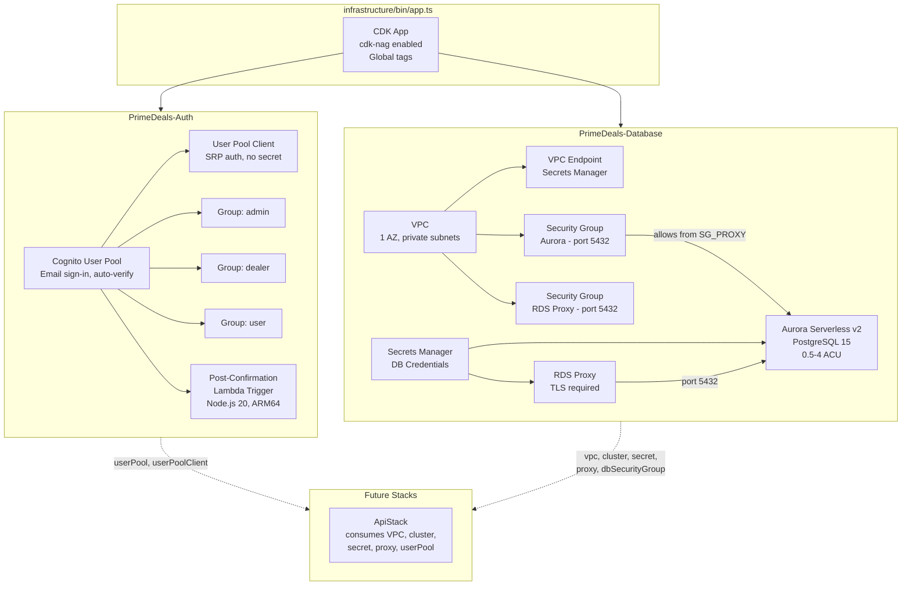
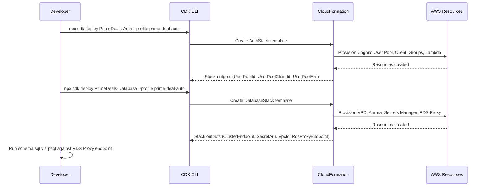

# Design Document: CDK Auth & Database Stacks

## Overview

This design covers two foundational CDK stacks for Prime Deal Auto:

1. **AuthStack** (`PrimeDeals-Auth`) — Provisions Amazon Cognito resources for user authentication: User Pool with email sign-up, User Pool Client for SRP auth, three user groups (admin, dealer, user), and a post-confirmation Lambda trigger stub.

2. **DatabaseStack** (`PrimeDeals-Database`) — Provisions the data tier: VPC with private subnets in a single AZ, Aurora PostgreSQL Serverless v2 cluster (0.5–4 ACU), Secrets Manager for credentials, security groups, and RDS Proxy for Lambda connection pooling.

Both stacks are instantiated in `infrastructure/bin/app.ts` with hardcoded account/region (`141814481613`/`us-east-1`), pass cdk-nag AwsSolutionsChecks, and export resources as public properties + CfnOutputs for downstream stack consumption.

### Key Design Decisions

- **Single AZ, no NAT Gateway**: Use 1 AZ and no NAT Gateways to minimize dev environment cost. Lambda functions that need AWS service access (Secrets Manager, etc.) will use VPC endpoints. This saves ~$32/mo per NAT Gateway.
- **Single writer, no reader**: Only one Aurora writer instance in a single AZ. No reader replica — all reads and writes go through the same instance via RDS Proxy. This is sufficient for dev/low-traffic and avoids the cost of a second instance.
- **No secret rotation**: CDK's `Credentials.fromGeneratedSecret()` creates the secret but we skip auto-rotation for dev. Rotation can be added for production.
- **Post-confirmation trigger as stub**: The Lambda logs the event and returns success. Actual DB sync is deferred until the ApiStack provides VPC connectivity and DB credentials.
- **Deletion protection off**: Aurora deletion protection is disabled for dev environment to allow easy teardown.
- **IAM auth disabled on RDS Proxy**: Using Secrets Manager credentials instead, which is simpler for the Lambda connection pattern.

## Architecture



### Deployment Flow



## Components and Interfaces

### AuthStack (`infrastructure/lib/stacks/auth-stack.ts`)

```typescript
interface AuthStackProps extends cdk.StackProps {}

class AuthStack extends cdk.Stack {
  // Public readonly properties for cross-stack references
  public readonly userPool: cognito.UserPool;
  public readonly userPoolClient: cognito.UserPoolClient;

  constructor(scope: Construct, id: string, props: AuthStackProps) {
    // 1. Create User Pool (email sign-in, auto-verify, password policy)
    // 2. Create User Pool Client (SRP auth, no secret)
    // 3. Create groups: admin, dealer, user
    // 4. Create post-confirmation Lambda trigger (stub)
    // 5. Add Lambda as trigger on User Pool
    // 6. CfnOutputs: UserPoolId, UserPoolClientId, UserPoolArn
    // 7. cdk-nag suppressions where needed
  }
}
```

**Cognito User Pool Configuration:**
- `signInAliases: { email: true }` — email as sign-in alias
- `autoVerify: { email: true }` — auto-verify email
- `selfSignUpEnabled: true`
- `accountRecovery: AccountRecovery.EMAIL_ONLY`
- `passwordPolicy`: min 8 chars, require uppercase, lowercase, digits, symbols
- `removalPolicy: RemovalPolicy.DESTROY` (dev environment)

**User Pool Client Configuration:**
- `authFlows: { userSrp: true }` — SRP authentication
- `generateSecret: false` — no client secret for browser-based auth

**Post-Confirmation Lambda:**
- Runtime: `lambda.Runtime.NODEJS_20_X`
- Architecture: `lambda.Architecture.ARM_64`
- Handler: `index.handler`
- Code: inline or bundled from `infrastructure/lib/lambda/post-confirmation/`
- Minimal IAM: basic Lambda execution role only

### DatabaseStack (`infrastructure/lib/stacks/database-stack.ts`)

```typescript
interface DatabaseStackProps extends cdk.StackProps {}

class DatabaseStack extends cdk.Stack {
  // Public readonly properties for cross-stack references
  public readonly vpc: ec2.Vpc;
  public readonly cluster: rds.DatabaseCluster;
  public readonly secret: secretsmanager.ISecret;
  public readonly proxy: rds.DatabaseProxy;
  public readonly dbSecurityGroup: ec2.SecurityGroup;

  constructor(scope: Construct, id: string, props: DatabaseStackProps) {
    // 1. Create VPC (1 AZ, private isolated subnets, no NAT, VPC endpoints for AWS services)
    // 2. Create Aurora security group
    // 3. Create Aurora Serverless v2 cluster (PostgreSQL 15, 0.5-4 ACU, single writer)
    // 4. Create RDS Proxy security group
    // 5. Create RDS Proxy (TLS required, Secrets Manager auth)
    // 6. Configure security group ingress rules
    // 7. Create VPC endpoints (Secrets Manager, RDS)
    // 8. CfnOutputs: ClusterEndpoint, SecretArn, VpcId, RdsProxyEndpoint
    // 9. cdk-nag suppressions where needed
  }
}
```

**VPC Configuration:**
- `maxAzs: 1` (single AZ for cost optimization)
- `natGateways: 0` (no NAT Gateway — saves ~$32/mo)
- Subnet configuration:
  - `PRIVATE_ISOLATED` — for Aurora cluster and RDS Proxy (no internet access needed)
- VPC Endpoints:
  - Secrets Manager Interface Endpoint — so Lambda can fetch DB credentials without NAT
  - RDS Interface Endpoint — for RDS Proxy connectivity

**Aurora Cluster Configuration:**
- Engine: `rds.DatabaseClusterEngine.auroraPostgres({ version: rds.AuroraPostgresEngineVersion.VER_15_4 })`
- `credentials: rds.Credentials.fromGeneratedSecret('postgres')` — auto-generated, stored in Secrets Manager
- `defaultDatabaseName: 'primedealauto'`
- `serverlessV2MinCapacity: 0.5`
- `serverlessV2MaxCapacity: 4`
- `storageEncrypted: true`
- `deletionProtection: false` (dev)
- `removalPolicy: RemovalPolicy.DESTROY` (dev)
- Writer: `rds.ClusterInstance.serverlessV2('writer')`
- Placed in `PRIVATE_ISOLATED` subnets

**RDS Proxy Configuration:**
- `secrets: [cluster.secret!]`
- `vpc` — same VPC as Aurora
- `vpcSubnets: { subnetType: ec2.SubnetType.PRIVATE_ISOLATED }` — same isolated subnets
- `requireTLS: true`
- `iamAuth: false` — using Secrets Manager credentials
- Security group allows inbound on port 5432

**Security Group Rules:**
- Aurora SG: inbound TCP 5432 from RDS Proxy SG only
- RDS Proxy SG: inbound TCP 5432 (from future Lambda SG, configured in ApiStack)

### Post-Confirmation Lambda Handler (`infrastructure/lib/lambda/post-confirmation/index.ts`)

```typescript
export async function handler(event: any): Promise<any> {
  console.log('Post-confirmation trigger invoked', JSON.stringify(event));
  // Stub: actual DB sync deferred to later spec
  return event;
}
```

### CDK App Entry Point Updates (`infrastructure/bin/app.ts`)

```typescript
import { AuthStack } from '../lib/stacks/auth-stack';
import { DatabaseStack } from '../lib/stacks/database-stack';

const auth = new AuthStack(app, 'PrimeDeals-Auth', { env });
const db = new DatabaseStack(app, 'PrimeDeals-Database', { env });
```

### cdk-nag Suppressions Strategy

Expected suppressions with justifications:

**AuthStack:**
- `AwsSolutions-COG1` — May fire for password policy; we meet all requirements but may need to suppress if CDK defaults differ from nag expectations
- `AwsSolutions-COG2` — MFA not required for dev environment (suppress with justification: "MFA deferred to production hardening phase")
- `AwsSolutions-IAM4` — Lambda uses AWS managed policy `AWSLambdaBasicExecutionRole` (suppress with justification: "Managed policy is appropriate for basic Lambda execution")
- `AwsSolutions-L1` — Lambda runtime version check (ensure Node.js 20 is latest supported)

**DatabaseStack:**
- `AwsSolutions-VPC7` — VPC Flow Logs not enabled (suppress with justification: "Flow logs deferred to monitoring stack, Spec 12")
- `AwsSolutions-RDS6` — IAM auth not enabled on Aurora (suppress with justification: "Using Secrets Manager credentials via RDS Proxy; IAM auth adds complexity without benefit for this architecture")
- `AwsSolutions-RDS10` — Deletion protection disabled (suppress with justification: "Dev environment; deletion protection enabled in production")
- `AwsSolutions-RDS14` — Aurora backtrack not enabled (suppress with justification: "Backtrack not supported on Aurora PostgreSQL")
- `AwsSolutions-SMG4` — Secret rotation not configured (suppress with justification: "Secret rotation deferred to production hardening phase")

## Data Models

### Cognito User Pool Schema

The User Pool uses email as the primary identifier. Standard attributes:

| Attribute | Type | Required | Mutable |
|-----------|------|----------|---------|
| email | String | Yes | Yes |
| name | String | No | Yes |
| phone_number | String | No | Yes |

### Cognito Groups

| Group Name | Description | Purpose |
|------------|-------------|---------|
| admin | Administrators | Full access to admin panel, car CRUD, lead management |
| dealer | Dealers | Placeholder for future dealer-specific features |
| user | Regular users | Default group, favorites, chat, enquiries |

### Aurora Database Schema

The full schema is defined in `backend/db/schema.sql` and contains 11 tables:

| Table | Purpose | Key Columns |
|-------|---------|-------------|
| users | User records synced from Cognito | cognito_sub, email, role |
| car_makes | Normalized car manufacturers | name (unique) |
| car_models | Normalized car models | make_id, name |
| car_variants | Normalized car variants | model_id, name |
| cars | Vehicle listings | make, model, year, price, status |
| car_images | Image references per car | car_id, s3_key, is_primary |
| favorites | User-car favorites | user_id, car_id (composite PK) |
| leads | Customer enquiries | email, car_id, status |
| chat_sessions | AI chat sessions | user_id, session_token |
| chat_messages | Chat message history | session_id, role, content |
| analytics_events | Page/car view tracking | event_type, car_id |

All tables use UUID primary keys (`uuid_generate_v4()`), `TIMESTAMPTZ` timestamps, and `updated_at` auto-update triggers where applicable.

### Secrets Manager Secret Structure

The CDK-generated secret for Aurora follows this structure:

```json
{
  "username": "postgres",
  "password": "<auto-generated>",
  "engine": "postgres",
  "host": "<cluster-endpoint>",
  "port": 5432,
  "dbname": "primedealauto",
  "dbClusterIdentifier": "<cluster-id>"
}
```

### CloudFormation Outputs

**AuthStack Outputs:**

| Output Name | Value | Consumer |
|-------------|-------|----------|
| UserPoolId | User Pool ID | Frontend env, ApiStack |
| UserPoolClientId | User Pool Client ID | Frontend env |
| UserPoolArn | User Pool ARN | ApiStack (authorizer) |

**DatabaseStack Outputs:**

| Output Name | Value | Consumer |
|-------------|-------|----------|
| ClusterEndpoint | Aurora writer endpoint | Reference only |
| SecretArn | Secrets Manager secret ARN | ApiStack Lambda env |
| VpcId | VPC ID | Reference only |
| RdsProxyEndpoint | RDS Proxy endpoint | ApiStack Lambda env (DB_HOST) |

## Correctness Properties

*A property is a characteristic or behavior that should hold true across all valid executions of a system — essentially, a formal statement about what the system should do. Properties serve as the bridge between human-readable specifications and machine-verifiable correctness guarantees.*

This spec is infrastructure-as-code (CDK stacks). The acceptance criteria are deterministic configuration checks — given a fixed stack definition, the synthesized CloudFormation template is always the same. There is no meaningful input space to randomize for property-based testing. CDK assertion tests (example-based) are the appropriate verification method.

After analyzing all 16 requirements and their acceptance criteria, the testable criteria fall into CDK template assertions (specific examples) rather than universal properties. The following property is the only one that generalizes across the spec:

### Property 1: Stack resource completeness invariant

*For any* valid instantiation of the AuthStack and DatabaseStack, the synthesized CloudFormation template SHALL contain at minimum: 1 Cognito User Pool, 1 User Pool Client, 3 User Pool Groups, 1 Lambda Function (AuthStack), and 1 VPC, 1 Aurora DB Cluster, 1 Secrets Manager Secret, 1 RDS Proxy (DatabaseStack). The resource counts must be invariant regardless of CDK version or construct library updates.

**Validates: Requirements 1.1, 2.1, 3.1, 3.2, 3.3, 4.1, 6.1, 7.1, 8.1, 10.1, 14.1–14.9**

### Property 2: CfnOutput completeness invariant

*For any* valid instantiation of the AuthStack, the synthesized template SHALL contain CfnOutputs named UserPoolId, UserPoolClientId, and UserPoolArn. *For any* valid instantiation of the DatabaseStack, the synthesized template SHALL contain CfnOutputs named ClusterEndpoint, SecretArn, VpcId, and RdsProxyEndpoint.

**Validates: Requirements 5.3, 5.4, 5.5, 11.6, 11.7, 11.8, 11.9, 16.3**

### Property 3: Post-confirmation trigger round trip

*For any* Cognito post-confirmation event object, the stub handler SHALL return the same event object unmodified (identity function).

**Validates: Requirements 4.3**

Note: The remaining acceptance criteria (User Pool password policy, auto-verify, SRP auth flow, Aurora scaling config, RDS Proxy TLS, security group rules, etc.) are all specific configuration assertions verified through example-based CDK template tests. They do not generalize into properties because the inputs are fixed (one stack definition → one template).

## Error Handling

### CDK Synthesis Errors

- **Missing dependencies**: If a required construct property is undefined, CDK throws at synth time. All required props are set in constructors.
- **cdk-nag violations**: Violations cause synth to fail with descriptive error messages. Suppressions with justifications are added for intentional deviations.
- **Invalid configurations**: CDK validates construct props at synth time (e.g., invalid engine version, invalid ACU range). Use CDK-supported enum values.

### Deployment Errors

- **Stack dependency failures**: AuthStack and DatabaseStack are independent — either can be deployed first. No cross-stack dependency between them in this spec.
- **Resource creation failures**: CloudFormation rolls back on failure. Aurora cluster creation can take 10-15 minutes.
- **VPC/subnet exhaustion**: The VPC uses /16 CIDR by default with CDK, providing ample address space.
- **Secrets Manager**: If secret creation fails, the Aurora cluster creation also fails (dependency). CloudFormation handles rollback.

### Post-Confirmation Lambda Errors

- The stub handler is intentionally simple — it logs and returns the event. If it throws, Cognito retries the trigger (up to 3 times).
- The handler does NOT block user sign-up on failure — Cognito still confirms the user even if the trigger fails.

### Schema Migration Errors

- Schema migration is a manual step (`psql -f schema.sql`). If it fails:
  - Check connectivity to RDS Proxy endpoint from within the VPC
  - Verify credentials from Secrets Manager
  - Check that the `primedealauto` database exists (created by Aurora's `defaultDatabaseName`)
  - The `uuid-ossp` extension requires `rds_superuser` role (the master user has this)

## Testing Strategy

### Unit Tests (CDK Assertions)

CDK assertion tests are the primary verification method for this spec. They synthesize the stack and inspect the CloudFormation template.

**Test file**: `infrastructure/test/auth-stack.test.ts`

Tests for AuthStack:
- Verify User Pool exists with email sign-in alias, auto-verify, password policy, self-sign-up, account recovery
- Verify User Pool Client exists with SRP auth flow, no client secret, COGNITO provider
- Verify 3 User Pool Groups exist (admin, dealer, user)
- Verify Lambda function exists with Node.js 20 runtime, ARM64 architecture
- Verify User Pool has PostConfirmation trigger configured
- Verify CfnOutputs: UserPoolId, UserPoolClientId, UserPoolArn

**Test file**: `infrastructure/test/database-stack.test.ts`

Tests for DatabaseStack:
- Verify VPC exists with expected subnet configuration
- Verify Aurora cluster exists with PostgreSQL engine, Serverless v2 scaling (0.5–4 ACU), database name `primedealauto`, storage encryption, deletion protection off
- Verify DB writer instance exists
- Verify Secrets Manager secret exists
- Verify Security groups exist with correct ingress rules (port 5432)
- Verify RDS Proxy exists with TLS required, IAM auth disabled
- Verify CfnOutputs: ClusterEndpoint, SecretArn, VpcId, RdsProxyEndpoint

**Test file**: `infrastructure/test/post-confirmation.test.ts`

Tests for Post-Confirmation Lambda handler:
- Verify handler returns the input event unchanged
- Verify handler logs the event (mock console.log)

### Property-Based Tests

Given the nature of this spec (deterministic CDK infrastructure), property-based testing has limited applicability. The three properties identified above map to:

- **Property 1 (Resource completeness)**: Implemented as CDK assertion tests checking `resourceCountIs()` for each resource type. Tag: `Feature: cdk-auth-database-stacks, Property 1: Stack resource completeness invariant`
- **Property 2 (CfnOutput completeness)**: Implemented as CDK assertion tests checking `hasOutput()` for each expected output. Tag: `Feature: cdk-auth-database-stacks, Property 2: CfnOutput completeness invariant`
- **Property 3 (Trigger round trip)**: Implemented as a unit test calling the handler with a sample event and asserting identity. Tag: `Feature: cdk-auth-database-stacks, Property 3: Post-confirmation trigger round trip`

### Testing Tools

- **Framework**: Vitest
- **CDK Assertions**: `aws-cdk-lib/assertions` (`Template.fromStack()`, `hasResourceProperties()`, `resourceCountIs()`, `hasOutput()`)
- **Property-based testing library**: `fast-check` — used for Property 3 (generating random event objects to verify the stub handler returns them unchanged). Minimum 100 iterations.

### Integration / Deployment Verification (Manual)

These are not automated tests but manual verification steps after deployment:

1. `cdk synth` passes without cdk-nag errors
2. `cdk deploy PrimeDeals-Auth` succeeds, outputs visible
3. `cdk deploy PrimeDeals-Database` succeeds, outputs visible
4. Test user sign-up via AWS CLI: `aws cognito-idp sign-up --client-id <id> --username test@example.com --password ...`
5. Connect to Aurora via RDS Proxy: `psql -h <proxy-endpoint> -U postgres -d primedealauto`
6. Run `schema.sql` and verify all 11 tables created
