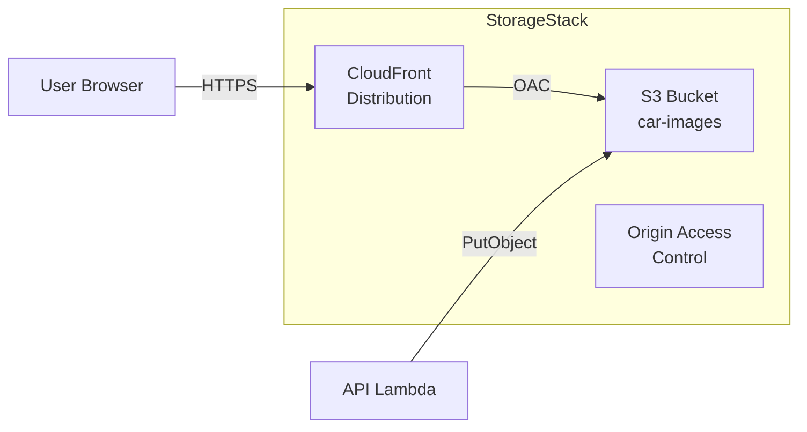
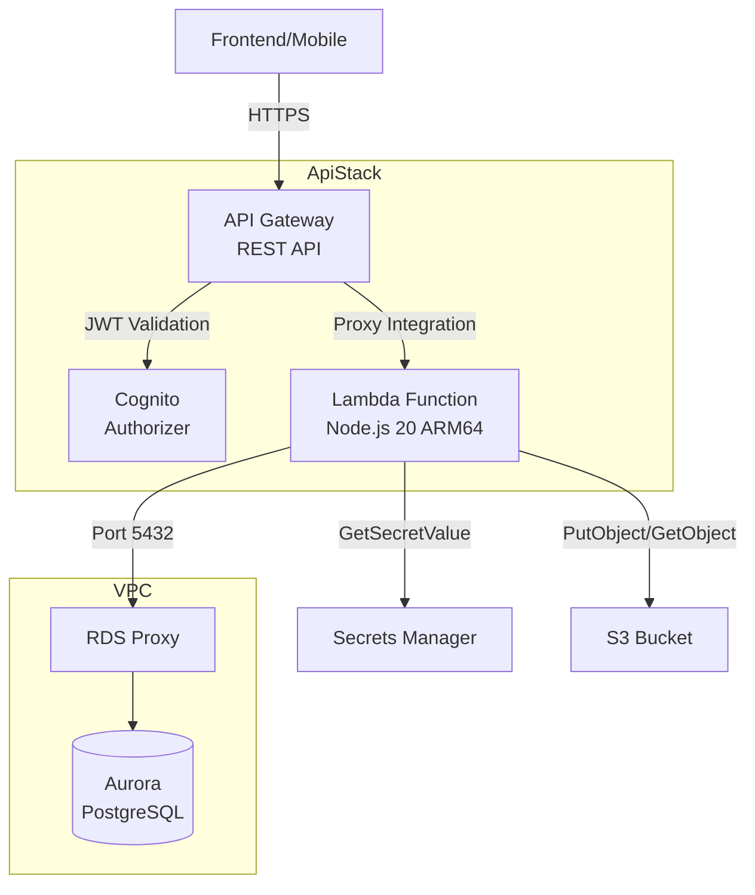
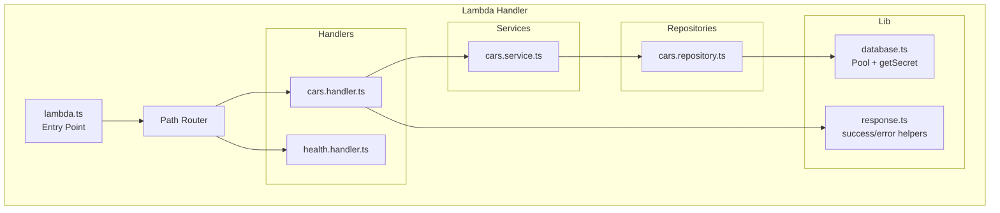

# Design: CDK Storage + API Stacks

## Overview

This design document describes the implementation of two AWS CDK stacks for Prime Deal Auto:

1. **StorageStack** (`PrimeDeals-Storage`): S3 bucket for car image storage with CloudFront CDN distribution using Origin Access Control (OAC)
2. **ApiStack** (`PrimeDeals-Api`): REST API Gateway with Cognito authorizer and a single Lambda function using path-based routing (Lambda-lith pattern)

These stacks build upon the existing AuthStack and DatabaseStack, receiving cross-stack references for the Cognito User Pool, VPC, RDS Proxy, and Secrets Manager secret.

### Key Design Decisions

1. **CloudFront OAC over OAI**: Origin Access Control is the modern, recommended approach for S3 origins, providing better security and supporting SSE-KMS encryption
2. **Lambda-lith pattern**: Single Lambda with path-based routing reduces cold starts, simplifies deployment, and allows connection reuse across all endpoints
3. **Handler/Service/Repository layering**: Clear separation of concerns enables unit testing at each layer and maintains code organization as the API grows
4. **RDS Proxy for Lambda**: Connection pooling handled server-side, allowing Lambda to use `max: 1` connection per instance while supporting high concurrency

### Deployment Dependencies

```
AuthStack ──────────────┐
                        ├──► ApiStack
DatabaseStack ──────────┤
                        │
StorageStack ───────────┘
```

StorageStack has no dependencies and can be deployed in parallel with AuthStack/DatabaseStack. ApiStack depends on all three.

---

## Architecture

### StorageStack Architecture



**S3 Bucket Configuration:**
- Versioning enabled for image history
- Block all public access (BPA)
- Server-side encryption (SSE-S3)
- CORS configured for frontend uploads
- Lifecycle rules for cost optimization (future enhancement)

**CloudFront Distribution:**
- Origin Access Control (OAC) for secure S3 access
- PriceClass_100 (US, Canada, Europe) for cost optimization
- Cache behavior: `max-age=31536000` for immutable image assets
- HTTPS only, TLSv1.2 minimum

### ApiStack Architecture



**API Gateway Configuration:**
- REST API with Lambda proxy integration
- Cognito User Pool authorizer for protected routes
- Stage-level caching with configurable TTLs
- Throttling: 100 req/s burst, 50 req/s steady-state
- CORS enabled at gateway level

**Lambda Configuration:**
- Runtime: Node.js 20, ARM64 (Graviton2)
- Memory: 1024 MB
- Timeout: 30 seconds
- VPC-attached with security group allowing RDS Proxy access
- Bundled with esbuild via `NodejsFunction`

### Lambda Handler Architecture (Path-Based Routing)



---

## Components and Interfaces

### StorageStack Components

```typescript
// infrastructure/lib/stacks/storage-stack.ts

export interface StorageStackProps extends cdk.StackProps {
  // No dependencies - can deploy independently
}

export class StorageStack extends cdk.Stack {
  // Exported for cross-stack reference
  public readonly bucket: s3.Bucket;
  public readonly distribution: cloudfront.Distribution;
  
  constructor(scope: Construct, id: string, props?: StorageStackProps) {
    // Implementation
  }
}
```

**S3 Bucket Interface:**
```typescript
const bucket = new s3.Bucket(this, 'CarImagesBucket', {
  versioned: true,
  blockPublicAccess: s3.BlockPublicAccess.BLOCK_ALL,
  encryption: s3.BucketEncryption.S3_MANAGED,
  enforceSSL: true,
  cors: [{
    allowedMethods: [s3.HttpMethods.PUT, s3.HttpMethods.GET],
    allowedOrigins: ['*'], // Tightened in production
    allowedHeaders: ['*'],
    maxAge: 3000,
  }],
  removalPolicy: cdk.RemovalPolicy.DESTROY, // Dev only
  autoDeleteObjects: true, // Dev only
});
```

**CloudFront OAC Interface:**
```typescript
const oac = new cloudfront.S3OriginAccessControl(this, 'OAC', {
  signing: cloudfront.Signing.SIGV4_ALWAYS,
});

const distribution = new cloudfront.Distribution(this, 'Distribution', {
  defaultBehavior: {
    origin: origins.S3BucketOrigin.withOriginAccessControl(bucket, {
      originAccessControl: oac,
    }),
    viewerProtocolPolicy: cloudfront.ViewerProtocolPolicy.REDIRECT_TO_HTTPS,
    cachePolicy: cloudfront.CachePolicy.CACHING_OPTIMIZED,
    responseHeadersPolicy: cloudfront.ResponseHeadersPolicy.CORS_ALLOW_ALL_ORIGINS,
  },
  priceClass: cloudfront.PriceClass.PRICE_CLASS_100,
  minimumProtocolVersion: cloudfront.SecurityPolicyProtocol.TLS_V1_2_2021,
});
```

### ApiStack Components

```typescript
// infrastructure/lib/stacks/api-stack.ts

export interface ApiStackProps extends cdk.StackProps {
  // From AuthStack
  userPool: cognito.IUserPool;
  
  // From DatabaseStack
  vpc: ec2.IVpc;
  dbSecurityGroup: ec2.ISecurityGroup;
  rdsProxy: rds.IDatabaseProxy;
  dbSecret: secretsmanager.ISecret;
  
  // From StorageStack
  bucket: s3.IBucket;
  distribution: cloudfront.IDistribution;
}

export class ApiStack extends cdk.Stack {
  public readonly api: apigateway.RestApi;
  public readonly lambdaFunction: lambda.Function;
  
  constructor(scope: Construct, id: string, props: ApiStackProps) {
    // Implementation
  }
}
```

**Lambda Function Interface:**
```typescript
const lambdaSecurityGroup = new ec2.SecurityGroup(this, 'LambdaSG', {
  vpc: props.vpc,
  description: 'Security group for API Lambda - allows outbound to RDS Proxy',
  allowAllOutbound: false,
});

// Allow Lambda to connect to RDS Proxy
lambdaSecurityGroup.addEgressRule(
  props.dbSecurityGroup,
  ec2.Port.tcp(5432),
  'Allow outbound to RDS Proxy'
);

const apiLambda = new NodejsFunction(this, 'ApiHandler', {
  runtime: lambda.Runtime.NODEJS_20_X,
  architecture: lambda.Architecture.ARM_64,
  entry: path.join(__dirname, '../../../backend/src/lambda.ts'),
  handler: 'handler',
  memorySize: 1024,
  timeout: cdk.Duration.seconds(30),
  vpc: props.vpc,
  vpcSubnets: { subnetType: ec2.SubnetType.PRIVATE_ISOLATED },
  securityGroups: [lambdaSecurityGroup],
  environment: {
    DB_HOST: props.rdsProxy.endpoint,
    DB_NAME: 'primedealauto',
    SECRET_ARN: props.dbSecret.secretArn,
    S3_BUCKET: props.bucket.bucketName,
    CLOUDFRONT_URL: `https://${props.distribution.distributionDomainName}`,
    FRONTEND_URL: process.env.FRONTEND_URL || '*',
  },
  bundling: {
    minify: true,
    sourceMap: true,
    externalModules: ['@aws-sdk/*'], // Use Lambda-provided SDK
  },
});
```

**API Gateway Interface:**
```typescript
const api = new apigateway.RestApi(this, 'Api', {
  restApiName: 'PrimeDealAuto-Api',
  description: 'Prime Deal Auto REST API',
  deployOptions: {
    stageName: 'v1',
    cachingEnabled: true,
    cacheClusterEnabled: true,
    cacheClusterSize: '0.5',
    throttlingBurstLimit: 100,
    throttlingRateLimit: 50,
  },
  defaultCorsPreflightOptions: {
    allowOrigins: apigateway.Cors.ALL_ORIGINS,
    allowMethods: apigateway.Cors.ALL_METHODS,
    allowHeaders: ['Content-Type', 'Authorization'],
  },
});

// Cognito authorizer for protected routes
const cognitoAuthorizer = new apigateway.CognitoUserPoolsAuthorizer(this, 'CognitoAuthorizer', {
  cognitoUserPools: [props.userPool],
  identitySource: 'method.request.header.Authorization',
});

// Lambda integration
const lambdaIntegration = new apigateway.LambdaIntegration(apiLambda, {
  proxy: true,
});

// Routes
const carsResource = api.root.addResource('cars');
carsResource.addMethod('GET', lambdaIntegration); // Public
carsResource.addMethod('POST', lambdaIntegration, {
  authorizer: cognitoAuthorizer,
  authorizationType: apigateway.AuthorizationType.COGNITO,
}); // Admin only (checked in Lambda)
```

### Backend Components

**Database Connection (backend/src/lib/database.ts):**
```typescript
import { Pool, PoolConfig } from 'pg';
import { SecretsManagerClient, GetSecretValueCommand } from '@aws-sdk/client-secrets-manager';

interface DbSecret {
  username: string;
  password: string;
  host: string;
  port: number;
  dbname: string;
}

let cachedSecret: DbSecret | null = null;

async function getSecret(): Promise<DbSecret> {
  if (cachedSecret) return cachedSecret;
  
  const client = new SecretsManagerClient({});
  const response = await client.send(
    new GetSecretValueCommand({ SecretId: process.env.SECRET_ARN })
  );
  
  cachedSecret = JSON.parse(response.SecretString!);
  return cachedSecret!;
}

// Pool initialized outside handler for connection reuse
let pool: Pool | null = null;

export async function getPool(): Promise<Pool> {
  if (pool) return pool;
  
  const secret = await getSecret();
  
  const config: PoolConfig = {
    host: process.env.DB_HOST, // RDS Proxy endpoint
    port: 5432,
    database: process.env.DB_NAME,
    user: secret.username,
    password: secret.password,
    max: 1, // RDS Proxy handles pooling
    ssl: { rejectUnauthorized: true },
    keepAlive: true,
    connectionTimeoutMillis: 5000,
  };
  
  pool = new Pool(config);
  return pool;
}
```

**Response Helpers (backend/src/lib/response.ts):**
```typescript
import { APIGatewayProxyResult } from 'aws-lambda';

const corsHeaders = {
  'Access-Control-Allow-Origin': process.env.FRONTEND_URL || '*',
  'Access-Control-Allow-Headers': 'Content-Type,Authorization',
  'Access-Control-Allow-Methods': 'GET,POST,PUT,PATCH,DELETE,OPTIONS',
  'Content-Type': 'application/json',
};

export function success<T>(data: T, statusCode = 200): APIGatewayProxyResult {
  return {
    statusCode,
    headers: corsHeaders,
    body: JSON.stringify({ success: true, data }),
  };
}

export function error(
  message: string,
  code: string,
  statusCode = 400
): APIGatewayProxyResult {
  return {
    statusCode,
    headers: corsHeaders,
    body: JSON.stringify({ success: false, error: message, code }),
  };
}

export function paginated<T>(
  data: T[],
  total: number,
  page: number,
  limit: number
): APIGatewayProxyResult {
  return success({
    data,
    total,
    page,
    limit,
    hasMore: page * limit < total,
  });
}
```

**Cars Repository (backend/src/repositories/cars.repository.ts):**
```typescript
import { getPool } from '../lib/database';
import { Car } from '../types';

export interface CarFilters {
  make?: string;
  model?: string;
  minYear?: number;
  maxYear?: number;
  minPrice?: number;
  maxPrice?: number;
  condition?: string;
  transmission?: string;
  fuelType?: string;
  bodyType?: string;
  status?: string;
  limit: number;
  offset: number;
  sortBy: string;
  sortOrder: 'asc' | 'desc';
}

const ALLOWED_SORT_COLUMNS = ['price', 'year', 'mileage', 'created_at'];

export class CarRepository {
  async findAll(filters: CarFilters): Promise<{ cars: Car[]; total: number }> {
    const pool = await getPool();
    
    const conditions: string[] = ['status = $1'];
    const params: unknown[] = [filters.status || 'active'];
    let paramIndex = 2;
    
    if (filters.make) {
      conditions.push(`make ILIKE $${paramIndex++}`);
      params.push(`%${filters.make}%`);
    }
    if (filters.model) {
      conditions.push(`model ILIKE $${paramIndex++}`);
      params.push(`%${filters.model}%`);
    }
    if (filters.minYear) {
      conditions.push(`year >= $${paramIndex++}`);
      params.push(filters.minYear);
    }
    if (filters.maxYear) {
      conditions.push(`year <= $${paramIndex++}`);
      params.push(filters.maxYear);
    }
    if (filters.minPrice) {
      conditions.push(`price >= $${paramIndex++}`);
      params.push(filters.minPrice);
    }
    if (filters.maxPrice) {
      conditions.push(`price <= $${paramIndex++}`);
      params.push(filters.maxPrice);
    }
    if (filters.condition) {
      conditions.push(`condition = $${paramIndex++}`);
      params.push(filters.condition);
    }
    if (filters.transmission) {
      conditions.push(`transmission = $${paramIndex++}`);
      params.push(filters.transmission);
    }
    if (filters.fuelType) {
      conditions.push(`fuel_type = $${paramIndex++}`);
      params.push(filters.fuelType);
    }
    if (filters.bodyType) {
      conditions.push(`body_type ILIKE $${paramIndex++}`);
      params.push(`%${filters.bodyType}%`);
    }
    
    const whereClause = conditions.join(' AND ');
    
    // Whitelist sort column to prevent SQL injection
    const sortColumn = ALLOWED_SORT_COLUMNS.includes(filters.sortBy)
      ? filters.sortBy
      : 'created_at';
    const sortOrder = filters.sortOrder === 'asc' ? 'ASC' : 'DESC';
    
    // Count query
    const countResult = await pool.query(
      `SELECT COUNT(*) FROM cars WHERE ${whereClause}`,
      params
    );
    const total = parseInt(countResult.rows[0].count, 10);
    
    // Data query with pagination
    params.push(filters.limit, filters.offset);
    const dataResult = await pool.query(
      `SELECT * FROM cars 
       WHERE ${whereClause} 
       ORDER BY ${sortColumn} ${sortOrder}
       LIMIT $${paramIndex++} OFFSET $${paramIndex}`,
      params
    );
    
    return { cars: dataResult.rows, total };
  }
  
  async findById(id: string): Promise<Car | null> {
    const pool = await getPool();
    const result = await pool.query(
      'SELECT * FROM cars WHERE id = $1',
      [id]
    );
    return result.rows[0] || null;
  }
}
```

**Cars Service (backend/src/services/cars.service.ts):**
```typescript
import { CarRepository, CarFilters } from '../repositories/cars.repository';
import { Car } from '../types';

export interface ListCarsInput {
  make?: string;
  model?: string;
  minYear?: number;
  maxYear?: number;
  minPrice?: number;
  maxPrice?: number;
  condition?: string;
  transmission?: string;
  fuelType?: string;
  bodyType?: string;
  limit?: number;
  offset?: number;
  sortBy?: string;
  sortOrder?: 'asc' | 'desc';
}

export class CarService {
  private repository: CarRepository;
  
  constructor() {
    this.repository = new CarRepository();
  }
  
  async listCars(input: ListCarsInput): Promise<{
    cars: Car[];
    total: number;
    page: number;
    limit: number;
    hasMore: boolean;
  }> {
    const limit = Math.min(input.limit || 20, 100);
    const offset = input.offset || 0;
    
    const filters: CarFilters = {
      ...input,
      limit,
      offset,
      sortBy: input.sortBy || 'created_at',
      sortOrder: input.sortOrder || 'desc',
      status: 'active', // Public endpoint always filters active
    };
    
    const { cars, total } = await this.repository.findAll(filters);
    const page = Math.floor(offset / limit) + 1;
    
    return {
      cars,
      total,
      page,
      limit,
      hasMore: offset + cars.length < total,
    };
  }
  
  async getCarById(id: string): Promise<Car | null> {
    return this.repository.findById(id);
  }
}
```

**Cars Handler (backend/src/handlers/cars.handler.ts):**
```typescript
import { APIGatewayProxyEvent, APIGatewayProxyResult } from 'aws-lambda';
import { CarService, ListCarsInput } from '../services/cars.service';
import { success, error, paginated } from '../lib/response';

const carService = new CarService();

export async function handleGetCars(
  event: APIGatewayProxyEvent
): Promise<APIGatewayProxyResult> {
  const query = event.queryStringParameters || {};
  
  const input: ListCarsInput = {
    make: query.make,
    model: query.model,
    minYear: query.minYear ? parseInt(query.minYear, 10) : undefined,
    maxYear: query.maxYear ? parseInt(query.maxYear, 10) : undefined,
    minPrice: query.minPrice ? parseFloat(query.minPrice) : undefined,
    maxPrice: query.maxPrice ? parseFloat(query.maxPrice) : undefined,
    condition: query.condition,
    transmission: query.transmission,
    fuelType: query.fuelType,
    bodyType: query.bodyType,
    limit: query.limit ? parseInt(query.limit, 10) : 20,
    offset: query.offset ? parseInt(query.offset, 10) : 0,
    sortBy: query.sortBy,
    sortOrder: query.sortOrder as 'asc' | 'desc' | undefined,
  };
  
  const result = await carService.listCars(input);
  
  return paginated(result.cars, result.total, result.page, result.limit);
}

export async function handleGetCarById(
  event: APIGatewayProxyEvent
): Promise<APIGatewayProxyResult> {
  const carId = event.pathParameters?.carId;
  
  if (!carId) {
    return error('Car ID is required', 'VALIDATION_ERROR', 400);
  }
  
  const car = await carService.getCarById(carId);
  
  if (!car) {
    return error('Car not found', 'NOT_FOUND', 404);
  }
  
  return success(car);
}
```

---

## Data Models

### CDK Stack Props

```typescript
// StorageStack - no props required (independent stack)
interface StorageStackProps extends cdk.StackProps {}

// ApiStack - receives cross-stack references
interface ApiStackProps extends cdk.StackProps {
  userPool: cognito.IUserPool;
  vpc: ec2.IVpc;
  dbSecurityGroup: ec2.ISecurityGroup;
  rdsProxy: rds.IDatabaseProxy;
  dbSecret: secretsmanager.ISecret;
  bucket: s3.IBucket;
  distribution: cloudfront.IDistribution;
}
```

### Lambda Environment Variables

| Variable | Source | Description |
|----------|--------|-------------|
| `DB_HOST` | DatabaseStack.proxy.endpoint | RDS Proxy endpoint |
| `DB_NAME` | Hardcoded: `primedealauto` | Database name |
| `SECRET_ARN` | DatabaseStack.secret.secretArn | Secrets Manager ARN |
| `S3_BUCKET` | StorageStack.bucket.bucketName | S3 bucket for images |
| `CLOUDFRONT_URL` | StorageStack.distribution.distributionDomainName | CDN URL prefix |
| `FRONTEND_URL` | Environment variable | CORS origin |

### API Response Types

```typescript
// Success response
interface SuccessResponse<T> {
  success: true;
  data: T;
}

// Error response
interface ErrorResponse {
  success: false;
  error: string;
  code: 'VALIDATION_ERROR' | 'NOT_FOUND' | 'UNAUTHORIZED' | 'FORBIDDEN' | 'RATE_LIMITED' | 'INTERNAL_ERROR';
}

// Paginated response
interface PaginatedData<T> {
  data: T[];
  total: number;
  page: number;
  limit: number;
  hasMore: boolean;
}
```

### Database Secret Structure

```typescript
// Stored in Secrets Manager, auto-generated by Aurora
interface DbSecret {
  username: string;      // 'postgres'
  password: string;      // Auto-generated
  host: string;          // Aurora cluster endpoint
  port: number;          // 5432
  dbname: string;        // 'primedealauto'
  engine: string;        // 'postgres'
}
```

### CloudFormation Outputs

| Stack | Output | Export Name | Description |
|-------|--------|-------------|-------------|
| StorageStack | BucketName | PrimeDeals-Storage-BucketName | S3 bucket name |
| StorageStack | BucketArn | PrimeDeals-Storage-BucketArn | S3 bucket ARN |
| StorageStack | DistributionId | PrimeDeals-Storage-DistributionId | CloudFront distribution ID |
| StorageStack | DistributionDomainName | PrimeDeals-Storage-DistributionDomainName | CloudFront domain |
| ApiStack | ApiUrl | PrimeDeals-Api-ApiUrl | API Gateway endpoint URL |
| ApiStack | ApiId | PrimeDeals-Api-ApiId | API Gateway ID |


---

## Correctness Properties

*A property is a characteristic or behavior that should hold true across all valid executions of a system—essentially, a formal statement about what the system should do. Properties serve as the bridge between human-readable specifications and machine-verifiable correctness guarantees.*

### Property 1: S3 Bucket Security Configuration

*For any* synthesized StorageStack CloudFormation template, the S3 bucket resource SHALL have versioning enabled, block all public access, and server-side encryption with SSE-S3.

**Validates: Requirements 1.1, 1.2, 1.3**

### Property 2: CloudFront OAC Configuration

*For any* synthesized StorageStack CloudFormation template, the CloudFront distribution SHALL use Origin Access Control (not OAI) and the S3 bucket policy SHALL only allow access from the CloudFront distribution via the OAC service principal.

**Validates: Requirements 2.1, 2.2, 2.3**

### Property 3: CloudFront Price Class

*For any* synthesized StorageStack CloudFormation template, the CloudFront distribution SHALL have PriceClass set to PriceClass_100.

**Validates: Requirements 2.5**

### Property 4: API Gateway Configuration

*For any* synthesized ApiStack CloudFormation template, the REST API SHALL have Lambda proxy integration, a Cognito User Pool authorizer, stage-level caching enabled, and throttling configured.

**Validates: Requirements 3.1, 3.2, 3.4, 3.5**

### Property 5: Lambda Function Configuration

*For any* synthesized ApiStack CloudFormation template, the Lambda function SHALL have Node.js 20 runtime, ARM64 architecture, 1024 MB memory, 30 second timeout, VPC configuration, and all required environment variables (DB_HOST, DB_NAME, SECRET_ARN, S3_BUCKET, CLOUDFRONT_URL).

**Validates: Requirements 4.1, 4.2, 4.3, 4.5**

### Property 6: Lambda IAM Least Privilege

*For any* synthesized ApiStack CloudFormation template, the Lambda execution role SHALL have IAM policies scoped to specific resources (not wildcard) for Secrets Manager read, S3 read/write, and VPC networking.

**Validates: Requirements 4.6, 10.5**

### Property 7: Request Routing Correctness

*For any* HTTP request to the Lambda handler, the router SHALL:
- Return 200 with CORS headers for OPTIONS requests
- Delegate to the correct handler for matching routes
- Return 404 with NOT_FOUND code for unmatched routes
- Return 500 with INTERNAL_ERROR code for unhandled exceptions

**Validates: Requirements 5.1, 5.2, 5.3, 5.4, 5.5**

### Property 8: Success Response Format

*For any* successful API response, the body SHALL be valid JSON with structure `{ success: true, data: <payload> }`.

**Validates: Requirements 6.1**

### Property 9: Error Response Format

*For any* error API response, the body SHALL be valid JSON with structure `{ success: false, error: <string>, code: <error_code> }` where error_code is one of the defined error codes.

**Validates: Requirements 6.2**

### Property 10: Paginated Response Format

*For any* paginated API response, the data object SHALL contain all required fields: `data` (array), `total` (number), `page` (number), `limit` (number), and `hasMore` (boolean).

**Validates: Requirements 6.3**

### Property 11: Response Headers

*For any* API response from the Lambda handler, the response SHALL include CORS headers (Access-Control-Allow-Origin, Access-Control-Allow-Headers, Access-Control-Allow-Methods) and Content-Type: application/json.

**Validates: Requirements 6.4, 6.5**

### Property 12: Secrets Manager Credential Caching

*For any* sequence of database operations within a single Lambda invocation, the Secrets Manager credentials SHALL be fetched at most once (cached after first fetch).

**Validates: Requirements 7.5**

### Property 13: Repository Return Type Correctness

*For any* Car object returned by the CarRepository, the object SHALL contain all required fields defined in the Car interface (id, make, model, year, price, mileage, condition, transmission, fuel_type, status, views_count, created_at, updated_at).

**Validates: Requirements 8.5**

### Property 14: Lambda Security Group Egress

*For any* synthesized ApiStack CloudFormation template, the Lambda security group SHALL have an egress rule allowing TCP port 5432 to the database security group.

**Validates: Requirements 9.4**

### Property 15: CloudFormation Outputs

*For any* synthesized ApiStack CloudFormation template, there SHALL be a CfnOutput for ApiUrl with an export name.

**Validates: Requirements 9.5**

### Property 16: No Hardcoded Resource Names

*For any* synthesized StorageStack or ApiStack CloudFormation template, S3 bucket names and other resource names SHALL NOT be hardcoded (should use CDK-generated names or references).

**Validates: Requirements 10.3**

### Property 17: Resource Tagging

*For any* synthesized StorageStack or ApiStack CloudFormation template, resources that support tagging SHALL have Project and Environment tags.

**Validates: Requirements 10.4**

---

## Error Handling

### CDK Stack Errors

| Error Scenario | Handling | User Impact |
|----------------|----------|-------------|
| Missing cross-stack props | TypeScript compile error | Deployment blocked |
| cdk-nag violation | Synth fails with violation report | Must fix or add documented suppression |
| Invalid construct ID change | cdk diff shows replacement | Review before deploy to prevent data loss |
| VPC subnet not found | CloudFormation deployment fails | Check VPC configuration |

### Lambda Runtime Errors

| Error Scenario | HTTP Status | Error Code | Handling |
|----------------|-------------|------------|----------|
| Invalid request body | 400 | VALIDATION_ERROR | Return validation message |
| Resource not found | 404 | NOT_FOUND | Return "not found" message |
| Missing/invalid JWT | 401 | UNAUTHORIZED | API Gateway rejects before Lambda |
| User lacks permission | 403 | FORBIDDEN | Check Cognito groups in handler |
| Rate limit exceeded | 429 | RATE_LIMITED | API Gateway throttling response |
| Database connection failed | 500 | INTERNAL_ERROR | Log error, return generic message |
| Secrets Manager error | 500 | INTERNAL_ERROR | Log error, return generic message |
| Unhandled exception | 500 | INTERNAL_ERROR | Catch-all, log stack trace |

### Database Connection Errors

```typescript
// Error handling in database.ts
export async function getPool(): Promise<Pool> {
  try {
    if (pool) return pool;
    
    const secret = await getSecret();
    pool = new Pool({ /* config */ });
    
    // Test connection on first use
    await pool.query('SELECT 1');
    return pool;
  } catch (error) {
    console.error('Database connection error:', {
      error: error instanceof Error ? error.message : 'Unknown error',
      host: process.env.DB_HOST,
    });
    throw new Error('Database connection failed');
  }
}
```

### Secrets Manager Errors

```typescript
async function getSecret(): Promise<DbSecret> {
  try {
    if (cachedSecret) return cachedSecret;
    
    const client = new SecretsManagerClient({});
    const response = await client.send(
      new GetSecretValueCommand({ SecretId: process.env.SECRET_ARN })
    );
    
    if (!response.SecretString) {
      throw new Error('Secret value is empty');
    }
    
    cachedSecret = JSON.parse(response.SecretString);
    return cachedSecret!;
  } catch (error) {
    console.error('Secrets Manager error:', {
      error: error instanceof Error ? error.message : 'Unknown error',
      secretArn: process.env.SECRET_ARN,
    });
    throw new Error('Failed to retrieve database credentials');
  }
}
```

### cdk-nag Suppressions

Required suppressions with justification:

```typescript
// StorageStack
NagSuppressions.addResourceSuppressions(bucket, [
  {
    id: 'AwsSolutions-S1',
    reason: 'S3 access logging deferred to MonitoringStack (Spec 12)',
  },
]);

NagSuppressions.addResourceSuppressions(distribution, [
  {
    id: 'AwsSolutions-CFR1',
    reason: 'Geo restrictions not required for car dealership serving South Africa',
  },
  {
    id: 'AwsSolutions-CFR2',
    reason: 'WAF integration deferred to production hardening (Spec 14)',
  },
  {
    id: 'AwsSolutions-CFR4',
    reason: 'Custom SSL certificate deferred — using CloudFront default certificate for dev',
  },
]);

// ApiStack
NagSuppressions.addResourceSuppressions(api, [
  {
    id: 'AwsSolutions-APIG2',
    reason: 'Request validation handled in Lambda handler with Zod schemas',
  },
  {
    id: 'AwsSolutions-APIG4',
    reason: 'Authorization handled per-method — some endpoints are intentionally public',
  },
  {
    id: 'AwsSolutions-COG4',
    reason: 'Cognito authorizer configured for protected endpoints only',
  },
]);

NagSuppressions.addResourceSuppressions(apiLambda, [
  {
    id: 'AwsSolutions-IAM4',
    reason: 'AWSLambdaVPCAccessExecutionRole managed policy required for VPC-attached Lambda',
  },
]);
```

---

## Testing Strategy

### Dual Testing Approach

This feature requires both unit tests and property-based tests:

- **Unit tests**: Verify specific CDK template outputs, handler behavior for known inputs, and integration points
- **Property tests**: Verify universal properties across all valid inputs (response formats, routing behavior)

### Property-Based Testing Configuration

- **Library**: fast-check (already installed in infrastructure/node_modules)
- **Minimum iterations**: 100 per property test
- **Tag format**: `Feature: cdk-storage-api-stacks, Property {number}: {property_text}`

### CDK Stack Tests (Unit Tests)

Location: `infrastructure/test/`

```typescript
// storage-stack.test.ts
import { Template } from 'aws-cdk-lib/assertions';
import * as cdk from 'aws-cdk-lib';
import { StorageStack } from '../lib/stacks/storage-stack';

describe('StorageStack', () => {
  let template: Template;
  
  beforeAll(() => {
    const app = new cdk.App();
    const stack = new StorageStack(app, 'TestStorageStack');
    template = Template.fromStack(stack);
  });
  
  // Property 1: S3 Bucket Security Configuration
  test('S3 bucket has versioning enabled', () => {
    template.hasResourceProperties('AWS::S3::Bucket', {
      VersioningConfiguration: { Status: 'Enabled' },
    });
  });
  
  test('S3 bucket blocks public access', () => {
    template.hasResourceProperties('AWS::S3::Bucket', {
      PublicAccessBlockConfiguration: {
        BlockPublicAcls: true,
        BlockPublicPolicy: true,
        IgnorePublicAcls: true,
        RestrictPublicBuckets: true,
      },
    });
  });
  
  test('S3 bucket has SSE-S3 encryption', () => {
    template.hasResourceProperties('AWS::S3::Bucket', {
      BucketEncryption: {
        ServerSideEncryptionConfiguration: [{
          ServerSideEncryptionByDefault: {
            SSEAlgorithm: 'AES256',
          },
        }],
      },
    });
  });
  
  // Property 2: CloudFront OAC Configuration
  test('CloudFront distribution uses OAC', () => {
    template.hasResourceProperties('AWS::CloudFront::Distribution', {
      DistributionConfig: {
        Origins: [{
          S3OriginConfig: {
            OriginAccessIdentity: '', // Empty means OAC is used
          },
        }],
      },
    });
    template.resourceCountIs('AWS::CloudFront::OriginAccessControl', 1);
  });
  
  // Property 3: CloudFront Price Class
  test('CloudFront uses PriceClass_100', () => {
    template.hasResourceProperties('AWS::CloudFront::Distribution', {
      DistributionConfig: {
        PriceClass: 'PriceClass_100',
      },
    });
  });
});
```

```typescript
// api-stack.test.ts
import { Template, Match } from 'aws-cdk-lib/assertions';
import * as cdk from 'aws-cdk-lib';
import * as cognito from 'aws-cdk-lib/aws-cognito';
import * as ec2 from 'aws-cdk-lib/aws-ec2';
import * as rds from 'aws-cdk-lib/aws-rds';
import * as s3 from 'aws-cdk-lib/aws-s3';
import * as cloudfront from 'aws-cdk-lib/aws-cloudfront';
import { ApiStack } from '../lib/stacks/api-stack';

describe('ApiStack', () => {
  let template: Template;
  
  beforeAll(() => {
    const app = new cdk.App();
    
    // Mock dependencies
    const mockStack = new cdk.Stack(app, 'MockStack');
    const vpc = new ec2.Vpc(mockStack, 'Vpc');
    const userPool = new cognito.UserPool(mockStack, 'UserPool');
    const bucket = new s3.Bucket(mockStack, 'Bucket');
    const distribution = new cloudfront.Distribution(mockStack, 'Distribution', {
      defaultBehavior: { origin: new origins.S3Origin(bucket) },
    });
    // ... other mocks
    
    const stack = new ApiStack(app, 'TestApiStack', {
      userPool,
      vpc,
      // ... other props
    });
    template = Template.fromStack(stack);
  });
  
  // Property 4: API Gateway Configuration
  test('REST API has Lambda integration', () => {
    template.hasResourceProperties('AWS::ApiGateway::Method', {
      Integration: {
        Type: 'AWS_PROXY',
      },
    });
  });
  
  test('API Gateway has Cognito authorizer', () => {
    template.hasResourceProperties('AWS::ApiGateway::Authorizer', {
      Type: 'COGNITO_USER_POOLS',
    });
  });
  
  // Property 5: Lambda Function Configuration
  test('Lambda has correct runtime and architecture', () => {
    template.hasResourceProperties('AWS::Lambda::Function', {
      Runtime: 'nodejs20.x',
      Architectures: ['arm64'],
    });
  });
  
  test('Lambda has correct memory and timeout', () => {
    template.hasResourceProperties('AWS::Lambda::Function', {
      MemorySize: 1024,
      Timeout: 30,
    });
  });
  
  test('Lambda has required environment variables', () => {
    template.hasResourceProperties('AWS::Lambda::Function', {
      Environment: {
        Variables: {
          DB_HOST: Match.anyValue(),
          DB_NAME: 'primedealauto',
          SECRET_ARN: Match.anyValue(),
          S3_BUCKET: Match.anyValue(),
          CLOUDFRONT_URL: Match.anyValue(),
        },
      },
    });
  });
  
  // Property 14: Lambda Security Group Egress
  test('Lambda security group allows egress to RDS on 5432', () => {
    template.hasResourceProperties('AWS::EC2::SecurityGroupEgress', {
      IpProtocol: 'tcp',
      FromPort: 5432,
      ToPort: 5432,
    });
  });
  
  // Property 15: CloudFormation Outputs
  test('ApiUrl output exists', () => {
    template.hasOutput('ApiUrl', {});
  });
});
```

### Lambda Handler Tests (Property-Based)

Location: `backend/tests/unit/`

```typescript
// response.test.ts
import { describe, test, expect } from 'vitest';
import * as fc from 'fast-check';
import { success, error, paginated } from '../../src/lib/response';

describe('Response Helpers', () => {
  // Feature: cdk-storage-api-stacks, Property 8: Success Response Format
  test('success response has correct structure for any data', () => {
    fc.assert(
      fc.property(fc.anything(), (data) => {
        const response = success(data);
        const body = JSON.parse(response.body);
        
        expect(body.success).toBe(true);
        expect(body).toHaveProperty('data');
        expect(response.statusCode).toBe(200);
      }),
      { numRuns: 100 }
    );
  });
  
  // Feature: cdk-storage-api-stacks, Property 9: Error Response Format
  test('error response has correct structure for any message and code', () => {
    const errorCodes = ['VALIDATION_ERROR', 'NOT_FOUND', 'UNAUTHORIZED', 'FORBIDDEN', 'RATE_LIMITED', 'INTERNAL_ERROR'];
    
    fc.assert(
      fc.property(
        fc.string({ minLength: 1 }),
        fc.constantFrom(...errorCodes),
        fc.integer({ min: 400, max: 599 }),
        (message, code, statusCode) => {
          const response = error(message, code, statusCode);
          const body = JSON.parse(response.body);
          
          expect(body.success).toBe(false);
          expect(body.error).toBe(message);
          expect(body.code).toBe(code);
          expect(response.statusCode).toBe(statusCode);
        }
      ),
      { numRuns: 100 }
    );
  });
  
  // Feature: cdk-storage-api-stacks, Property 10: Paginated Response Format
  test('paginated response has all required fields', () => {
    fc.assert(
      fc.property(
        fc.array(fc.anything()),
        fc.integer({ min: 0 }),
        fc.integer({ min: 1 }),
        fc.integer({ min: 1, max: 100 }),
        (data, total, page, limit) => {
          const response = paginated(data, total, page, limit);
          const body = JSON.parse(response.body);
          
          expect(body.success).toBe(true);
          expect(body.data).toHaveProperty('data');
          expect(body.data).toHaveProperty('total');
          expect(body.data).toHaveProperty('page');
          expect(body.data).toHaveProperty('limit');
          expect(body.data).toHaveProperty('hasMore');
          expect(typeof body.data.hasMore).toBe('boolean');
        }
      ),
      { numRuns: 100 }
    );
  });
  
  // Feature: cdk-storage-api-stacks, Property 11: Response Headers
  test('all responses include CORS headers and Content-Type', () => {
    fc.assert(
      fc.property(fc.anything(), (data) => {
        const response = success(data);
        
        expect(response.headers).toHaveProperty('Access-Control-Allow-Origin');
        expect(response.headers).toHaveProperty('Access-Control-Allow-Headers');
        expect(response.headers).toHaveProperty('Access-Control-Allow-Methods');
        expect(response.headers?.['Content-Type']).toBe('application/json');
      }),
      { numRuns: 100 }
    );
  });
});
```

```typescript
// lambda.test.ts
import { describe, test, expect, vi } from 'vitest';
import * as fc from 'fast-check';
import { handler } from '../../src/lambda';
import type { APIGatewayProxyEvent } from 'aws-lambda';

const createMockEvent = (method: string, path: string): APIGatewayProxyEvent => ({
  httpMethod: method,
  path,
  headers: {},
  queryStringParameters: null,
  pathParameters: null,
  body: null,
  isBase64Encoded: false,
  requestContext: {} as any,
  resource: '',
  stageVariables: null,
  multiValueHeaders: {},
  multiValueQueryStringParameters: null,
});

describe('Lambda Handler Routing', () => {
  // Feature: cdk-storage-api-stacks, Property 7: Request Routing Correctness
  test('OPTIONS requests return 200 with CORS headers', async () => {
    fc.assert(
      await fc.asyncProperty(
        fc.webPath(),
        async (path) => {
          const event = createMockEvent('OPTIONS', path);
          const response = await handler(event);
          
          expect(response.statusCode).toBe(200);
          expect(response.headers).toHaveProperty('Access-Control-Allow-Origin');
        }
      ),
      { numRuns: 100 }
    );
  });
  
  test('unmatched routes return 404 with NOT_FOUND code', async () => {
    const unmatchedPaths = fc.string({ minLength: 1 }).filter(
      (s) => !s.startsWith('/health') && !s.startsWith('/cars')
    );
    
    fc.assert(
      await fc.asyncProperty(
        unmatchedPaths,
        fc.constantFrom('GET', 'POST', 'PUT', 'DELETE'),
        async (path, method) => {
          const event = createMockEvent(method, `/${path}`);
          const response = await handler(event);
          const body = JSON.parse(response.body);
          
          expect(response.statusCode).toBe(404);
          expect(body.code).toBe('NOT_FOUND');
        }
      ),
      { numRuns: 100 }
    );
  });
  
  test('health endpoint returns success', async () => {
    const event = createMockEvent('GET', '/health');
    const response = await handler(event);
    const body = JSON.parse(response.body);
    
    expect(response.statusCode).toBe(200);
    expect(body.success).toBe(true);
  });
});
```

### Test Execution

```bash
# CDK stack tests
cd infrastructure
npm test

# Backend handler tests
cd backend
npm test

# Run with coverage
npm test -- --coverage

# Run specific test file
npm test -- response.test.ts
```
