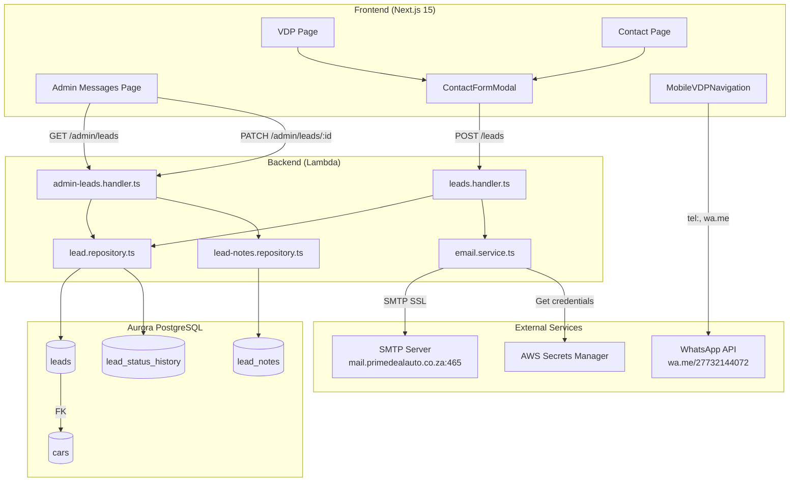

# Contact & Enquiry System - Technical Design

## Overview

This design document describes the technical implementation of the Contact & Enquiry System for Prime Deal Auto. The system enables customers to contact the dealership via email, WhatsApp, and phone through multiple touchpoints: VDP contact forms, test drive scheduling, WhatsApp integration, and a general contact page. An admin dashboard provides lead management capabilities including filtering, status tracking, and notes.

The implementation follows the existing project conventions: Next.js 15 App Router for frontend, Lambda with node-postgres for backend, Aurora PostgreSQL for database, and SMTP via nodemailer for email delivery.

## Architecture



## Components and Interfaces

### Backend Components

#### 1. Email Service (`backend/src/services/email.service.ts`)

Handles SMTP email delivery using nodemailer with SSL connection to the dealership mail server.

```typescript
interface EmailConfig {
  host: string;           // mail.primedealauto.co.za
  port: number;           // 465
  secure: boolean;        // true (SSL)
  auth: {
    user: string;         // From Secrets Manager
    pass: string;         // From Secrets Manager
  };
}

interface SendEmailParams {
  to: string;
  subject: string;
  text: string;
  html?: string;
}

class EmailService {
  private transporter: nodemailer.Transporter | null = null;
  
  async initialize(): Promise<void>;
  async sendEmail(params: SendEmailParams): Promise<boolean>;
  async sendLeadNotification(lead: Lead, car?: Car): Promise<boolean>;
}
```

#### 2. Lead Repository Extensions (`backend/src/repositories/lead.repository.ts`)

Extended to support new fields, admin queries, and status history.

```typescript
interface CreateLeadInput {
  firstName?: string;
  lastName?: string;
  email: string;
  phone?: string;
  whatsappNumber?: string;      // NEW
  subject?: string;              // NEW
  enquiry?: string;
  carId?: string;
  source: string;
  enquiryType?: 'general' | 'test_drive' | 'car_enquiry';  // NEW
}

interface LeadFilters {
  status?: string;
  enquiryType?: string;
  search?: string;              // Search by name, email, phone
  dateFrom?: Date;
  dateTo?: Date;
  limit?: number;
  offset?: number;
}

interface LeadWithCar extends Lead {
  car?: {
    id: string;
    make: string;
    model: string;
    variant?: string;
    year: number;
    price: number;
    primaryImage?: string;
  };
}

class LeadRepository {
  // Existing methods
  async create(input: CreateLeadInput): Promise<string>;
  async findById(id: string): Promise<Lead | null>;
  
  // Extended methods
  async findByIdWithCar(id: string): Promise<LeadWithCar | null>;
  async findAllWithFilters(filters: LeadFilters): Promise<{ leads: LeadWithCar[]; total: number }>;
  async updateStatus(id: string, newStatus: string, changedBy: string): Promise<void>;
  async getStatusHistory(leadId: string): Promise<LeadStatusHistory[]>;
  async getStats(): Promise<LeadStats>;
}
```

#### 3. Lead Notes Repository (`backend/src/repositories/lead-notes.repository.ts`)

New repository for managing lead notes.

```typescript
interface CreateNoteInput {
  leadId: string;
  noteText: string;
  createdBy: string;  // Admin user ID
}

interface LeadNote {
  id: string;
  leadId: string;
  noteText: string;
  createdBy: string;
  createdByName?: string;
  createdAt: Date;
}

class LeadNotesRepository {
  async create(input: CreateNoteInput): Promise<string>;
  async findByLeadId(leadId: string): Promise<LeadNote[]>;
  async delete(noteId: string): Promise<void>;
}
```

#### 4. Admin Leads Handler (`backend/src/handlers/admin-leads.handler.ts`)

New handler for admin lead management endpoints.

```typescript
// GET /admin/leads - List leads with filters
async function handleGetLeads(event: APIGatewayProxyEvent): Promise<APIGatewayProxyResult>;

// GET /admin/leads/stats - Get lead statistics
async function handleGetLeadStats(event: APIGatewayProxyEvent): Promise<APIGatewayProxyResult>;

// GET /admin/leads/:id - Get single lead with car details
async function handleGetLeadById(event: APIGatewayProxyEvent): Promise<APIGatewayProxyResult>;

// PATCH /admin/leads/:id - Update lead status
async function handleUpdateLead(event: APIGatewayProxyEvent): Promise<APIGatewayProxyResult>;

// DELETE /admin/leads/:id - Delete lead
async function handleDeleteLead(event: APIGatewayProxyEvent): Promise<APIGatewayProxyResult>;

// GET /admin/leads/:id/notes - Get lead notes
async function handleGetLeadNotes(event: APIGatewayProxyEvent): Promise<APIGatewayProxyResult>;

// POST /admin/leads/:id/notes - Add note to lead
async function handleAddLeadNote(event: APIGatewayProxyEvent): Promise<APIGatewayProxyResult>;

// GET /admin/leads/:id/history - Get status history
async function handleGetLeadHistory(event: APIGatewayProxyEvent): Promise<APIGatewayProxyResult>;
```

### Frontend Components

#### 1. ContactFormModal (`frontend/components/contact/ContactFormModal.tsx`)

Reusable modal component for VDP contact forms and test drive requests.

```typescript
interface ContactFormModalProps {
  isOpen: boolean;
  onClose: () => void;
  car?: {
    id: string;
    make: string;
    model: string;
    variant?: string;
    year: number;
    price: number;
  };
  formType: 'enquiry' | 'test_drive';
}

// Form fields:
// - firstName: string (required)
// - surname: string (required)
// - email: string (required, validated)
// - phone: string (optional, phone input with country code)
// - preferredDate: Date (optional, only for test_drive)
// - message: string (required, prefilled with car details)
```

#### 2. MobileVDPNavigation (`frontend/components/layout/MobileVDPNavigation.tsx`)

Custom mobile bottom navigation for VDP pages with contact actions.

```typescript
interface MobileVDPNavigationProps {
  car: {
    id: string;
    make: string;
    model: string;
    variant?: string;
    year: number;
    price: number;
  };
  onEmailClick: () => void;  // Opens ContactFormModal
}

// Four action buttons:
// - Phone: tel:+27732144072
// - WhatsApp: wa.me/27732144072?text={prefilled message}
// - Email: Opens modal
// - Home: Navigate to /
```

#### 3. Admin Messages Page (`frontend/app/dashboard/messages/page.tsx`)

Dashboard page for lead management with filtering, search, and detail panel.

```typescript
// Page structure:
// - Stats cards row (Total, New, Contacted, Converted)
// - Filter bar (search, status, type, date range)
// - Lead table with pagination
// - Slide-over detail panel (right side)

interface LeadTableRow {
  id: string;
  status: 'new' | 'contacted' | 'qualified' | 'converted' | 'closed';
  clientName: string;
  email: string;
  phone?: string;
  carInfo?: string;  // "2024 BMW X5" or "General Enquiry"
  enquiryType: 'general' | 'test_drive' | 'car_enquiry';
  createdAt: Date;
}
```

#### 4. LeadDetailPanel (`frontend/components/dashboard/LeadDetailPanel.tsx`)

Slide-over panel for viewing and managing individual leads.

```typescript
interface LeadDetailPanelProps {
  leadId: string | null;
  isOpen: boolean;
  onClose: () => void;
  onStatusChange: () => void;  // Refresh list after status change
}

// Sections:
// - Contact info (name, email, phone, WhatsApp)
// - Car summary card (if car_id exists)
// - Message content
// - Status dropdown with history
// - Notes section with add form
// - Action buttons (Reply via Email, Reply via WhatsApp)
```

## Data Models

### Database Schema Extensions

#### Migration: `backend/db/migrations/003_leads_extension.sql`

```sql
-- Add new columns to leads table
ALTER TABLE leads
ADD COLUMN IF NOT EXISTS enquiry_type VARCHAR(20) DEFAULT 'general'
  CHECK (enquiry_type IN ('general', 'test_drive', 'car_enquiry')),
ADD COLUMN IF NOT EXISTS subject VARCHAR(255),
ADD COLUMN IF NOT EXISTS whatsapp_number VARCHAR(50);

-- Add index for enquiry_type filtering
CREATE INDEX IF NOT EXISTS idx_leads_enquiry_type ON leads(enquiry_type);

-- Create lead_notes table
CREATE TABLE IF NOT EXISTS lead_notes (
  id UUID PRIMARY KEY DEFAULT uuid_generate_v4(),
  lead_id UUID NOT NULL REFERENCES leads(id) ON DELETE CASCADE,
  note_text TEXT NOT NULL,
  created_by UUID REFERENCES users(id) ON DELETE SET NULL,
  created_at TIMESTAMPTZ NOT NULL DEFAULT NOW()
);

CREATE INDEX idx_lead_notes_lead_id ON lead_notes(lead_id);

-- Create lead_status_history table
CREATE TABLE IF NOT EXISTS lead_status_history (
  id UUID PRIMARY KEY DEFAULT uuid_generate_v4(),
  lead_id UUID NOT NULL REFERENCES leads(id) ON DELETE CASCADE,
  old_status VARCHAR(20),
  new_status VARCHAR(20) NOT NULL,
  changed_by UUID REFERENCES users(id) ON DELETE SET NULL,
  changed_at TIMESTAMPTZ NOT NULL DEFAULT NOW()
);

CREATE INDEX idx_lead_status_history_lead_id ON lead_status_history(lead_id);
CREATE INDEX idx_lead_status_history_changed_at ON lead_status_history(changed_at DESC);
```

### TypeScript Types

```typescript
// backend/src/types/index.ts - Extended Lead type
interface Lead {
  id: string;
  first_name?: string;
  last_name?: string;
  email: string;
  phone?: string;
  whatsapp_number?: string;
  country?: string;
  subject?: string;
  enquiry?: string;
  car_id?: string;
  source: string;
  enquiry_type: 'general' | 'test_drive' | 'car_enquiry';
  status: 'new' | 'contacted' | 'qualified' | 'converted' | 'closed';
  assigned_to?: string;
  created_at: Date;
  updated_at: Date;
}

interface LeadNote {
  id: string;
  lead_id: string;
  note_text: string;
  created_by?: string;
  created_by_name?: string;
  created_at: Date;
}

interface LeadStatusHistory {
  id: string;
  lead_id: string;
  old_status?: string;
  new_status: string;
  changed_by?: string;
  changed_by_name?: string;
  changed_at: Date;
}

interface LeadStats {
  total: number;
  new: number;
  contacted: number;
  qualified: number;
  converted: number;
  closed: number;
}
```

### API Request/Response Schemas

```typescript
// POST /leads - Enhanced request body
interface CreateLeadRequest {
  firstName?: string;
  lastName?: string;
  email: string;           // Required
  phone?: string;
  whatsappNumber?: string;
  subject?: string;
  enquiry?: string;
  carId?: string;
  enquiryType?: 'general' | 'test_drive' | 'car_enquiry';
}

// GET /admin/leads - Query parameters
interface GetLeadsQuery {
  status?: string;
  enquiryType?: string;
  search?: string;
  dateFrom?: string;       // ISO date
  dateTo?: string;         // ISO date
  limit?: number;          // Default 20, max 100
  offset?: number;         // Default 0
}

// GET /admin/leads - Response
interface GetLeadsResponse {
  data: LeadWithCar[];
  total: number;
  page: number;
  limit: number;
  hasMore: boolean;
}

// GET /admin/leads/stats - Response
interface GetLeadStatsResponse {
  total: number;
  new: number;
  contacted: number;
  qualified: number;
  converted: number;
  closed: number;
}


## Correctness Properties

*A property is a characteristic or behavior that should hold true across all valid executions of a system—essentially, a formal statement about what the system should do. Properties serve as the bridge between human-readable specifications and machine-verifiable correctness guarantees.*

### Property 1: Email Recipient Consistency

*For any* lead created through any contact form (VDP, test drive, or contact page), the email notification SHALL always be sent to sales@primedealauto.co.za.

**Validates: Requirements 1.1**

### Property 2: Email Body Contains Customer Details

*For any* lead with customer information (name, email, phone, message), the generated email body SHALL contain all provided non-empty fields.

**Validates: Requirements 1.5, 10.5, 10.6**

### Property 3: Email Body Contains Car Details When Present

*For any* lead with a linked car_id, the generated email body SHALL include the car's year, make, model, variant (if present), and formatted price (R prefix).

**Validates: Requirements 1.6, 10.7**

### Property 4: Form Prefill Contains Car Details

*For any* car displayed on the VDP, the contact form modal SHALL prefill the subject with "[Year] [Make] [Model] [Variant]" and the message with the price formatted as "R{price}".

**Validates: Requirements 2.3, 2.4, 3.4**

### Property 5: Test Drive Form Subject Format

*For any* test drive request form, the subject field SHALL be prefilled with "Test Drive Request: [Year] [Make] [Model] [Variant]".

**Validates: Requirements 3.3, 3.7, 10.3**

### Property 6: Lead Creation Links Car ID

*For any* form submission from a VDP page with a valid car, the created lead record SHALL have the car_id field set to that car's ID.

**Validates: Requirements 2.6**


### Property 7: Lead Creation Triggers Email

*For any* successful lead creation via POST /leads, an email notification SHALL be triggered (success or failure of email delivery is logged but does not affect lead creation).

**Validates: Requirements 2.7, 5.4, 9.1**

### Property 8: Email Failure Does Not Block Lead Creation

*For any* lead submission where the SMTP connection fails or email sending fails, the lead record SHALL still be created in the database and the API SHALL return success with the lead ID.

**Validates: Requirements 1.7, 9.6**

### Property 9: Form Validation Rejects Invalid Input

*For any* form submission with missing required fields (firstName, surname, email, message) or invalid email format, the form SHALL reject submission and display field-specific error messages without creating a lead.

**Validates: Requirements 2.9, 5.6, 5.7, 5.8, 9.7**

### Property 10: WhatsApp Link Format

*For any* WhatsApp button on VDP or mobile navigation, the link SHALL use the format `https://wa.me/27732144072?text={encoded_message}` where the message includes "Hi, I'm interested in the [Year] [Make] [Model] [Variant] listed at R[Price]. Is it still available?"

**Validates: Requirements 4.3, 4.4, 6.6**

### Property 11: Phone Link Format

*For any* phone button on VDP or mobile navigation, the link SHALL use the format `tel:+27732144072`.

**Validates: Requirements 6.5**

### Property 12: Contact Page Source Attribution

*For any* lead created from the /contact page, the lead record SHALL have source set to "contact_page".

**Validates: Requirements 5.3**

### Property 13: Test Drive Enquiry Type

*For any* lead created from a test drive form, the lead record SHALL have enquiry_type set to "test_drive".

**Validates: Requirements 3.6**


### Property 14: Status Change Creates History Record

*For any* lead status change via PATCH /admin/leads/:id, a new record SHALL be created in lead_status_history with the old_status, new_status, changed_by (admin user ID), and changed_at timestamp.

**Validates: Requirements 7.4.3, 7.4.4, 8.2.2**

### Property 15: Note Creation Records Metadata

*For any* note added to a lead via POST /admin/leads/:id/notes, the note record SHALL contain the note_text, created_by (admin user ID), and created_at timestamp.

**Validates: Requirements 7.5.4**

### Property 16: Leads Sorted By Date Descending

*For any* GET /admin/leads request without explicit sort parameters, the returned leads SHALL be sorted by created_at in descending order (newest first).

**Validates: Requirements 7.1.6**

### Property 17: Filter Returns Matching Leads Only

*For any* GET /admin/leads request with filter parameters (status, enquiryType, search, dateFrom, dateTo), all returned leads SHALL match ALL specified filter criteria.

**Validates: Requirements 7.2.6**

### Property 18: Lead Detail Shows Car When Present

*For any* lead with a linked car_id, the lead detail response SHALL include the car's id, make, model, variant, year, price, and primary image URL.

**Validates: Requirements 7.1.3, 7.3.4**

### Property 19: Notes Cascade Delete

*For any* lead that is deleted, all associated lead_notes records SHALL be automatically deleted via CASCADE.

**Validates: Requirements 8.1.3**

### Property 20: API Returns Lead ID On Success

*For any* successful POST /leads request, the response SHALL contain `{ success: true, data: { id: "<uuid>" } }` where id is the created lead's UUID.

**Validates: Requirements 9.5**

### Property 21: Email Subject Format By Enquiry Type

*For any* email notification:
- Car enquiries SHALL have subject: "New Enquiry: [Year] [Make] [Model]"
- Test drive requests SHALL have subject: "Test Drive Request: [Year] [Make] [Model]"
- General enquiries SHALL have subject: "New Contact Form Enquiry: [Subject]"

**Validates: Requirements 10.1, 10.2, 10.3, 10.4**

### Property 22: Default Status For New Leads

*For any* newly created lead, the status field SHALL default to "new" if not explicitly provided.

**Validates: Requirements 8.5**

### Property 23: Backward Compatibility

*For any* POST /leads request using the existing API schema (without enquiry_type, subject, whatsapp_number), the lead SHALL be created successfully with enquiry_type defaulting to "general".

**Validates: Requirements 8.8**


## Error Handling

### Email Service Errors

| Error Type | Handling | User Impact |
|------------|----------|-------------|
| SMTP Connection Timeout | Log error, continue with lead creation | None - lead is saved |
| SMTP Authentication Failure | Log error with alert, continue with lead creation | None - lead is saved |
| Invalid Recipient | Log error, continue with lead creation | None - lead is saved |
| Secrets Manager Access Denied | Log critical error, fail gracefully | Lead saved, email not sent |

**Key Principle**: Email delivery failures MUST NOT prevent lead creation. The lead is the primary business asset.

### API Validation Errors

| Field | Validation | Error Message |
|-------|------------|---------------|
| email | Required, valid format | "Email is required" / "Invalid email format" |
| firstName | Required for contact page | "First name is required" |
| lastName | Required for contact page | "Surname is required" |
| message | Required | "Message is required" |
| enquiryType | Enum validation | "Invalid enquiry type" |
| status | Enum validation | "Invalid status value" |

### Admin API Errors

| Scenario | Status Code | Error Code |
|----------|-------------|------------|
| Lead not found | 404 | NOT_FOUND |
| Invalid status transition | 400 | VALIDATION_ERROR |
| Missing admin auth | 401 | UNAUTHORIZED |
| Non-admin user | 403 | FORBIDDEN |
| Database error | 500 | INTERNAL_ERROR |

### Frontend Error States

1. **Form Submission Failure**: Display error banner with retry option
2. **Network Error**: Show "Unable to connect. Please try again."
3. **Validation Error**: Highlight invalid fields with inline messages
4. **Admin API Error**: Toast notification with error message

## Testing Strategy

### Unit Tests

**Backend Unit Tests** (`backend/tests/unit/`)

1. **Email Service Tests** (`email.service.test.ts`)
   - Test email body generation with various lead data
   - Test subject line formatting for each enquiry type
   - Test SMTP configuration loading from Secrets Manager (mocked)
   - Test error handling when SMTP fails

2. **Lead Repository Tests** (`lead.repository.test.ts`)
   - Test lead creation with all field combinations
   - Test idempotency (duplicate detection within 24h)
   - Test filter queries return correct results
   - Test status update creates history record
   - Test cascade delete for notes

3. **Lead Handler Tests** (`leads.handler.test.ts`)
   - Test POST /leads with valid data
   - Test validation error responses
   - Test email trigger on lead creation (mocked)

4. **Admin Leads Handler Tests** (`admin-leads.handler.test.ts`)
   - Test GET /admin/leads with various filters
   - Test PATCH /admin/leads/:id status update
   - Test POST /admin/leads/:id/notes
   - Test admin auth requirement


**Frontend Unit Tests** (`frontend/components/**/__tests__/`)

1. **ContactFormModal Tests** (`ContactFormModal.test.tsx`)
   - Test form renders with correct fields
   - Test prefill values for car enquiry
   - Test prefill values for test drive
   - Test validation error display
   - Test success state after submission

2. **MobileVDPNavigation Tests** (`MobileVDPNavigation.test.tsx`)
   - Test renders four action buttons
   - Test WhatsApp link format with car details
   - Test phone link format
   - Test email button triggers modal callback

3. **LeadDetailPanel Tests** (`LeadDetailPanel.test.tsx`)
   - Test renders lead information
   - Test car card shown when car_id exists
   - Test status dropdown options
   - Test notes section rendering

### Property-Based Tests

**Configuration**: Use `fast-check` library with minimum 100 iterations per test.

**Backend Property Tests** (`backend/tests/property/`)

1. **Email Body Generation** (`email-body.property.test.ts`)
   ```typescript
   // Feature: contact-enquiry-system, Property 2: Email Body Contains Customer Details
   // For any lead with customer information, email body contains all provided fields
   fc.assert(
     fc.property(
       fc.record({
         firstName: fc.string({ minLength: 1 }),
         lastName: fc.string({ minLength: 1 }),
         email: fc.emailAddress(),
         phone: fc.option(fc.string()),
         message: fc.string({ minLength: 1 }),
       }),
       (lead) => {
         const body = generateEmailBody(lead);
         expect(body).toContain(lead.firstName);
         expect(body).toContain(lead.lastName);
         expect(body).toContain(lead.email);
         expect(body).toContain(lead.message);
         if (lead.phone) expect(body).toContain(lead.phone);
       }
     ),
     { numRuns: 100 }
   );
   ```

2. **WhatsApp Link Generation** (`whatsapp-link.property.test.ts`)
   ```typescript
   // Feature: contact-enquiry-system, Property 10: WhatsApp Link Format
   // For any car, WhatsApp link contains correct phone and car details
   fc.assert(
     fc.property(
       fc.record({
         year: fc.integer({ min: 1990, max: 2025 }),
         make: fc.string({ minLength: 1 }),
         model: fc.string({ minLength: 1 }),
         price: fc.integer({ min: 1000, max: 10000000 }),
       }),
       (car) => {
         const link = generateWhatsAppLink(car);
         expect(link).toContain('wa.me/27732144072');
         expect(link).toContain(encodeURIComponent(car.year.toString()));
         expect(link).toContain(encodeURIComponent(car.make));
         expect(link).toContain(encodeURIComponent(car.model));
       }
     ),
     { numRuns: 100 }
   );
   ```


3. **Lead Filter Query** (`lead-filter.property.test.ts`)
   ```typescript
   // Feature: contact-enquiry-system, Property 17: Filter Returns Matching Leads Only
   // For any filter combination, all returned leads match all criteria
   fc.assert(
     fc.property(
       fc.record({
         status: fc.constantFrom('new', 'contacted', 'qualified', 'converted', 'closed'),
         enquiryType: fc.constantFrom('general', 'test_drive', 'car_enquiry'),
       }),
       async (filters) => {
         const result = await leadRepository.findAllWithFilters(filters);
         result.leads.forEach(lead => {
           expect(lead.status).toBe(filters.status);
           expect(lead.enquiry_type).toBe(filters.enquiryType);
         });
       }
     ),
     { numRuns: 100 }
   );
   ```

4. **Email Subject Format** (`email-subject.property.test.ts`)
   ```typescript
   // Feature: contact-enquiry-system, Property 21: Email Subject Format By Enquiry Type
   // For any enquiry type, subject follows correct format
   fc.assert(
     fc.property(
       fc.record({
         enquiryType: fc.constantFrom('general', 'test_drive', 'car_enquiry'),
         subject: fc.string({ minLength: 1 }),
         car: fc.option(fc.record({
           year: fc.integer({ min: 1990, max: 2025 }),
           make: fc.string({ minLength: 1 }),
           model: fc.string({ minLength: 1 }),
         })),
       }),
       (data) => {
         const subject = generateEmailSubject(data);
         if (data.enquiryType === 'test_drive' && data.car) {
           expect(subject).toMatch(/^Test Drive Request:/);
         } else if (data.enquiryType === 'car_enquiry' && data.car) {
           expect(subject).toMatch(/^New Enquiry:/);
         } else {
           expect(subject).toMatch(/^New Contact Form Enquiry:/);
         }
       }
     ),
     { numRuns: 100 }
   );
   ```

### Integration Tests

**Backend Integration Tests** (`backend/tests/integration/`)

1. **Lead Creation Flow** (`lead-creation.integration.test.ts`)
   - Create lead via POST /leads
   - Verify lead exists in database
   - Verify email was triggered (mocked SMTP)
   - Verify response contains lead ID

2. **Admin Lead Management** (`admin-leads.integration.test.ts`)
   - Create test leads
   - Fetch via GET /admin/leads with filters
   - Update status via PATCH
   - Verify status history created
   - Add notes and verify retrieval

**Frontend Integration Tests** (Playwright - `frontend/e2e/`)

1. **VDP Contact Flow** (`vdp-contact.spec.ts`)
   - Navigate to car detail page
   - Click "Message Dealer" button
   - Verify modal opens with prefilled data
   - Submit form
   - Verify success message

2. **Admin Messages Page** (`admin-messages.spec.ts`)
   - Login as admin
   - Navigate to /dashboard/messages
   - Verify stats cards display
   - Apply filters and verify results
   - Open lead detail panel
   - Update status and add note

### Email Delivery Verification

**Manual Test Procedure** (documented in requirements):
1. Submit test lead from VDP
2. Verify email received at sales@primedealauto.co.za
3. Verify subject line format
4. Verify body contains all customer and car details
5. Verify VDP link is clickable
