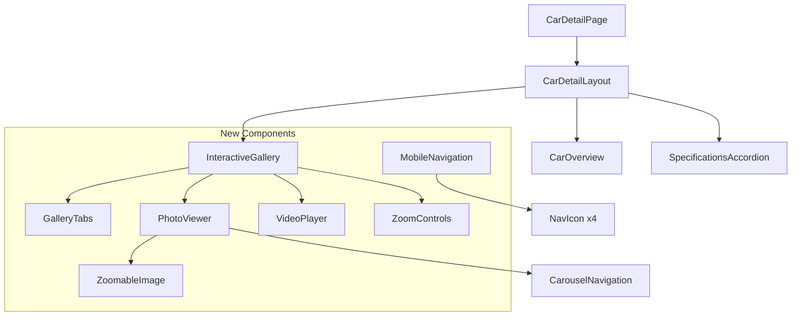

# Design Document: Interactive Showroom VDP

## Overview

This design transforms the Vehicle Detail Page (VDP) into an "Interactive Showroom" experience by:
1. Removing administrative clutter (360 View, VIN, Brochure)
2. Implementing a tabbed gallery with "All Photos" and "Video" tabs
3. Adding GPU-accelerated zoom controls with floating control bar
4. Integrating responsive YouTube/Vimeo video player
5. Mapping custom SVG icons to specification fields
6. Creating a luxury glassmorphism mobile navigation bar
7. Ensuring smooth animations without layout shifts

The implementation focuses on performance (GPU-accelerated transforms, no CLS) and premium UX.

## Architecture



## Components and Interfaces

### 1. InteractiveGallery Component

Replaces the current gallery section with tabbed media viewer.

```typescript
// frontend/components/cars/InteractiveGallery.tsx
'use client';

interface InteractiveGalleryProps {
  images: CarImage[];
  carName: string;
  videoUrl?: string;
}

type GalleryTab = 'photos' | 'video';

interface GalleryState {
  activeTab: GalleryTab;
  currentImageIndex: number;
  zoomLevel: number;  // 1.0 = 100%, 1.5 = 150%, etc.
}
```

**Key behaviors:**
- Default tab: "All Photos"
- Video tab hidden when `videoUrl` is undefined/empty
- Zoom range: 1.0x to 3.0x in 0.5x increments
- Carousel wraps at boundaries

### 2. ZoomControls Component

Floating control bar overlaid on the main image.

```typescript
// frontend/components/cars/ZoomControls.tsx
interface ZoomControlsProps {
  zoomLevel: number;
  onZoomIn: () => void;
  onZoomOut: () => void;
  onPrevious: () => void;
  onNext: () => void;
  canZoomIn: boolean;
  canZoomOut: boolean;
  currentIndex: number;
  totalImages: number;
}
```

**Layout:**
```
┌─────────────────────────────────────────┐
│                                         │
│              [Main Image]               │
│                                         │
│   ┌─────────────────────────────────┐   │
│   │  ◀  │  1/8  │  −  │  +  │  ▶   │   │
│   └─────────────────────────────────┘   │
└─────────────────────────────────────────┘
```

### 3. VideoPlayer Component

Responsive YouTube/Vimeo embed with 16:9 aspect ratio.

```typescript
// frontend/components/cars/VideoPlayer.tsx
interface VideoPlayerProps {
  url: string;
}

interface ParsedVideoUrl {
  provider: 'youtube' | 'vimeo' | 'unknown';
  videoId: string | null;
  embedUrl: string | null;
}
```

**URL parsing logic:**
- YouTube: Extract ID from `youtube.com/watch?v=ID`, `youtu.be/ID`, `youtube.com/embed/ID`
- Vimeo: Extract ID from `vimeo.com/ID`, `player.vimeo.com/video/ID`
- Invalid URLs: Show error fallback

### 4. MobileNavigation Component

Glassmorphism bottom navigation bar for mobile devices.

```typescript
// frontend/components/layout/MobileNavigation.tsx
interface NavItem {
  icon: string;  // SVG filename
  label: string;
  href?: string;
  action?: 'scroll-to-search';
}

const navItems: NavItem[] = [
  { icon: 'home-1-svgrepo-com.svg', label: 'Home', href: '/' },
  { icon: 'sedan-2-svgrepo-com.svg', label: 'Cars', href: '/cars' },
  { icon: 'contact-book-svgrepo-com.svg', label: 'Contact', href: '/contact' },
  { icon: 'search-svgrepo-com.svg', label: 'Search', action: 'scroll-to-search' },
];
```

### 5. Icon Mapping for Car Overview

```typescript
// frontend/lib/constants/icon-mapping.ts
export const CAR_OVERVIEW_ICONS: Record<string, string> = {
  'Body Type': 'car-muscle-design-svgrepo-com.svg',
  'Drive Type': 'car-front-svgrepo-com.svg',
  'Condition': 'condition-document-law-svgrepo-com.svg',
  'Engine Size': 'engine-motor-svgrepo-com.svg',
  'Doors': 'car-door-left-4-svgrepo-com.svg',
  'Cylinders': 'cylinder-svgrepo-com.svg',
  'Color': 'color-adjustement-mode-channels-svgrepo-com.svg',
};
```


## Data Models

### Gallery State

```typescript
interface GalleryState {
  activeTab: 'photos' | 'video';
  currentImageIndex: number;
  zoomLevel: number;  // Range: 1.0 - 3.0, step: 0.5
}

// Initial state
const initialState: GalleryState = {
  activeTab: 'photos',
  currentImageIndex: 0,
  zoomLevel: 1.0,
};
```

### Video URL Parsing

```typescript
interface ParsedVideo {
  provider: 'youtube' | 'vimeo' | 'unknown';
  videoId: string | null;
  embedUrl: string | null;
  isValid: boolean;
}

// YouTube patterns
const YOUTUBE_PATTERNS = [
  /(?:youtube\.com\/watch\?v=|youtu\.be\/|youtube\.com\/embed\/)([a-zA-Z0-9_-]{11})/,
];

// Vimeo patterns  
const VIMEO_PATTERNS = [
  /(?:vimeo\.com\/|player\.vimeo\.com\/video\/)(\d+)/,
];
```

### Zoom Configuration

```typescript
const ZOOM_CONFIG = {
  MIN: 1.0,
  MAX: 3.0,
  STEP: 0.5,
  DEFAULT: 1.0,
} as const;
```

## Correctness Properties

*A property is a characteristic or behavior that should hold true across all valid executions of a system—essentially, a formal statement about what the system should do. Properties serve as the bridge between human-readable specifications and machine-verifiable correctness guarantees.*

### Property 1: Video Tab Visibility Based on URL

*For any* car object, the Video tab should be visible if and only if `video_url` is a non-empty string.

**Validates: Requirements 2.2, 2.3**

### Property 2: Tab Content Switching

*For any* tab click event, the gallery should display content corresponding to the clicked tab (photos content for "All Photos", video player for "Video").

**Validates: Requirements 2.5**

### Property 3: Zoom Level Bounds

*For any* sequence of zoom in/out operations, the zoom level should remain within the range [1.0, 3.0].

**Validates: Requirements 3.5, 3.6**

### Property 4: Layout Stability During Zoom

*For any* zoom operation, the gallery container dimensions (width and height) should remain constant before and after the operation.

**Validates: Requirements 3.8, 7.4**

### Property 5: Carousel Navigation Wrapping

*For any* image array of length N, navigating left from index 0 should result in index N-1, and navigating right from index N-1 should result in index 0.

**Validates: Requirements 3.10, 3.11, 3.12, 3.13**

### Property 6: YouTube URL Parsing

*For any* valid YouTube URL (youtube.com/watch?v=ID, youtu.be/ID, youtube.com/embed/ID), the parser should extract the correct 11-character video ID and generate a valid embed URL.

**Validates: Requirements 4.4**

### Property 7: Vimeo URL Parsing

*For any* valid Vimeo URL (vimeo.com/ID, player.vimeo.com/video/ID), the parser should extract the numeric video ID and generate a valid embed URL.

**Validates: Requirements 4.5**

### Property 8: Invalid Video URL Handling

*For any* URL that does not match YouTube or Vimeo patterns, the video player should display an error fallback message.

**Validates: Requirements 4.7**

### Property 9: Mobile Navigation Routing

*For any* navigation icon tap (Home, Cars, Contact), the application should navigate to the corresponding route (/, /cars, /contact).

**Validates: Requirements 6.5, 6.6, 6.7**

### Property 10: Carousel Transition Stability

*For any* carousel navigation (previous/next), the gallery container dimensions should remain constant during and after the transition.

**Validates: Requirements 7.2**


## Error Handling

### Video Player Errors

| Error Condition | Handling |
|-----------------|----------|
| Invalid URL format | Display "Unable to load video" message with retry option |
| Unsupported provider | Display "Video format not supported" message |
| Empty video_url | Hide Video tab entirely (not an error state) |
| Iframe load failure | Display fallback message, log error |

### Image Loading Errors

| Error Condition | Handling |
|-----------------|----------|
| Image fails to load | Display placeholder with car icon |
| All images fail | Show "No images available" state |
| Slow loading | Show skeleton loader during load |

### Zoom Edge Cases

| Edge Case | Handling |
|-----------|----------|
| Zoom at max (3.0x) | Disable zoom in button |
| Zoom at min (1.0x) | Disable zoom out button |
| Rapid zoom clicks | Debounce to prevent jank |

## Testing Strategy

### Unit Tests (Vitest + Testing Library)

**Component Tests:**
- `InteractiveGallery.test.tsx`: Tab rendering, tab switching, default state
- `ZoomControls.test.tsx`: Button states, zoom level display
- `VideoPlayer.test.tsx`: URL parsing, embed rendering, error states
- `MobileNavigation.test.tsx`: Icon rendering, navigation links

**Utility Tests:**
- `parseVideoUrl.test.ts`: YouTube/Vimeo URL parsing edge cases
- `icon-mapping.test.ts`: Verify all icon mappings resolve to existing files

### Property-Based Tests (fast-check)

Each property test runs minimum 100 iterations.

```typescript
// Example: Property 3 - Zoom Level Bounds
// Feature: interactive-showroom-vdp, Property 3: Zoom level bounds
describe('Zoom Level Bounds', () => {
  it('should keep zoom level within [1.0, 3.0] for any sequence of operations', () => {
    fc.assert(
      fc.property(
        fc.array(fc.constantFrom('in', 'out'), { minLength: 1, maxLength: 50 }),
        (operations) => {
          let zoom = 1.0;
          for (const op of operations) {
            zoom = op === 'in' 
              ? Math.min(zoom + 0.5, 3.0) 
              : Math.max(zoom - 0.5, 1.0);
          }
          return zoom >= 1.0 && zoom <= 3.0;
        }
      ),
      { numRuns: 100 }
    );
  });
});
```

```typescript
// Example: Property 5 - Carousel Navigation Wrapping
// Feature: interactive-showroom-vdp, Property 5: Carousel wrapping
describe('Carousel Navigation Wrapping', () => {
  it('should wrap correctly at boundaries for any array length', () => {
    fc.assert(
      fc.property(
        fc.integer({ min: 1, max: 100 }),
        (arrayLength) => {
          // Left from 0 should go to N-1
          const leftFromZero = (0 - 1 + arrayLength) % arrayLength;
          // Right from N-1 should go to 0
          const rightFromLast = (arrayLength - 1 + 1) % arrayLength;
          
          return leftFromZero === arrayLength - 1 && rightFromLast === 0;
        }
      ),
      { numRuns: 100 }
    );
  });
});
```

```typescript
// Example: Property 6 - YouTube URL Parsing
// Feature: interactive-showroom-vdp, Property 6: YouTube URL parsing
describe('YouTube URL Parsing', () => {
  it('should extract video ID from any valid YouTube URL format', () => {
    fc.assert(
      fc.property(
        fc.stringMatching(/^[a-zA-Z0-9_-]{11}$/),
        (videoId) => {
          const urls = [
            `https://www.youtube.com/watch?v=${videoId}`,
            `https://youtu.be/${videoId}`,
            `https://www.youtube.com/embed/${videoId}`,
          ];
          
          return urls.every(url => {
            const parsed = parseVideoUrl(url);
            return parsed.provider === 'youtube' && parsed.videoId === videoId;
          });
        }
      ),
      { numRuns: 100 }
    );
  });
});
```

### Integration Tests

- Gallery with real car data renders correctly
- Tab switching preserves image index
- Mobile navigation appears/hides at breakpoint

### Visual Regression Tests (Optional)

- Glassmorphism styling on mobile nav
- Zoom control bar positioning
- Video player aspect ratio


## Implementation Details

### CSS Transform Zoom (GPU Acceleration)

```css
/* Zoom container - fixed dimensions prevent CLS */
.zoom-container {
  position: relative;
  overflow: hidden;
  width: 100%;
  aspect-ratio: 16/9;
}

/* Zoomable image - uses transform for GPU acceleration */
.zoomable-image {
  transform-origin: center center;
  transition: transform 0.2s ease-out;
  will-change: transform;
}

/* Zoom levels */
.zoom-1x { transform: scale(1.0); }
.zoom-1-5x { transform: scale(1.5); }
.zoom-2x { transform: scale(2.0); }
.zoom-2-5x { transform: scale(2.5); }
.zoom-3x { transform: scale(3.0); }
```

### Glassmorphism Mobile Navigation

```css
/* Glassmorphism with fallback */
.mobile-nav {
  background: rgba(255, 255, 255, 0.6);
  backdrop-filter: blur(20px);
  -webkit-backdrop-filter: blur(20px);
  border-top: 1px solid rgba(255, 255, 255, 0.2);
  padding-bottom: env(safe-area-inset-bottom, 20px);
}

/* Fallback for browsers without backdrop-filter */
@supports not (backdrop-filter: blur(20px)) {
  .mobile-nav {
    background: rgba(255, 255, 255, 0.95);
  }
}
```

### Video Player Responsive Embed

```css
/* 16:9 aspect ratio container */
.video-container {
  position: relative;
  width: 100%;
  aspect-ratio: 16/9;
  background: #000;
  border-radius: 16px;
  overflow: hidden;
}

.video-iframe {
  position: absolute;
  top: 0;
  left: 0;
  width: 100%;
  height: 100%;
  border: 0;
}
```

### Pulse Animation for Video Tab

```css
@keyframes subtle-pulse {
  0%, 100% { opacity: 1; }
  50% { opacity: 0.7; }
}

.video-tab-indicator {
  animation: subtle-pulse 2s ease-in-out infinite;
}
```

## File Changes Summary

### New Files
- `frontend/components/cars/InteractiveGallery.tsx`
- `frontend/components/cars/ZoomControls.tsx`
- `frontend/components/cars/VideoPlayer.tsx`
- `frontend/components/layout/MobileNavigation.tsx`
- `frontend/lib/utils/parseVideoUrl.ts`
- `frontend/lib/constants/icon-mapping.ts`

### Modified Files
- `frontend/components/cars/CarDetailLayout.tsx` - Remove 360 View, VIN, Brochure; use new gallery
- `frontend/app/cars/[carId]/page.tsx` - Add MobileNavigation
- `frontend/app/layout.tsx` - Add MobileNavigation globally (optional)

### Deleted/Removed Code
- 360 View MediaButton
- VIN field in Car Overview
- VIN row in Specifications accordion
- "View Vin Report" ActionButton
- "Car Brochure" ActionButton
