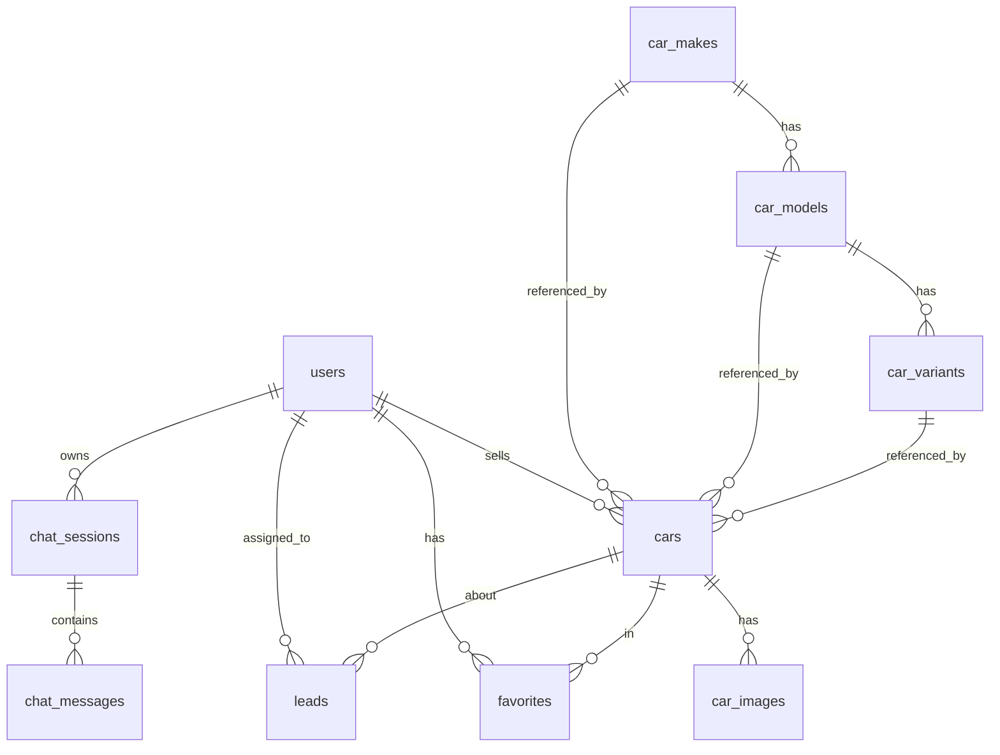

# Design Document: Project Scaffolding

## Overview

This design covers the initial scaffolding of the Prime Deal Auto monorepo — establishing three npm workspaces (frontend, backend, infrastructure) with all configuration, skeleton source files, shared types, database schema, and build tooling needed to begin feature development.

The scaffolding produces a clean, buildable project where:
- `npm install` from root installs all workspace dependencies
- Each workspace compiles TypeScript without errors
- The frontend starts a dev server and produces a production build
- The backend has a testable Lambda handler stub with Vitest
- The infrastructure synthesizes a valid CloudFormation template with cdk-nag checks
- The database schema is defined and ready for migration

This is a greenfield setup — no existing code to integrate with. The repo currently contains only documentation files and the `.kiro` spec directory.

## Architecture

### Monorepo Structure

The project uses npm workspaces (native to npm 7+) to manage three independent packages under a single root `package.json`. No additional monorepo tooling (Turborepo, Nx, Lerna) is needed at this stage.

```
prime-deal-auto/
├── package.json              # Root: defines workspaces, shared scripts, engine constraints
├── .gitignore                # Excludes node_modules, .next, cdk.out, dist, .env*
├── frontend/                 # Next.js 15 App Router
│   ├── package.json
│   ├── next.config.ts
│   ├── tailwind.config.ts
│   ├── tsconfig.json
│   ├── app/
│   │   ├── layout.tsx        # Root layout (HTML shell, metadata)
│   │   ├── page.tsx          # Home page placeholder
│   │   └── globals.css       # Tailwind CSS v4 directives
│   └── components/           # Empty, ready for component development
├── backend/                  # Lambda handler (Node.js 20)
│   ├── package.json
│   ├── tsconfig.json
│   ├── vitest.config.ts
│   ├── src/
│   │   ├── lambda.ts         # Main handler with path-based routing stub
│   │   ├── handlers/         # Placeholder directory
│   │   ├── services/         # Placeholder directory
│   │   ├── repositories/     # Placeholder directory
│   │   ├── lib/              # Placeholder directory
│   │   └── types/
│   │       └── index.ts      # Shared TypeScript types
│   ├── db/
│   │   ├── schema.sql        # Full PostgreSQL schema
│   │   └── migrations/       # Empty, ready for migration files
│   └── tests/
│       └── unit/
│           └── lambda.test.ts  # Health check handler test
└── infrastructure/           # AWS CDK v2
    ├── package.json
    ├── cdk.json
    ├── tsconfig.json
    └── bin/
        └── app.ts            # CDK app entry point (account/region locked, cdk-nag enabled)
```

### Design Decisions

1. **npm workspaces over Turborepo/Nx**: The project has only 3 workspaces with no cross-workspace build dependencies at this stage. npm workspaces provide sufficient dependency hoisting and script orchestration without additional tooling complexity. Turborepo can be added later if build caching becomes valuable.

2. **No shared package**: Shared types live in `backend/src/types/index.ts` rather than a separate `shared/` workspace. The frontend will copy or reference these types as needed in later specs. This avoids premature abstraction.

3. **Placeholder directories with `.gitkeep`**: Empty directories (`handlers/`, `services/`, `repositories/`, `lib/`, `migrations/`) use `.gitkeep` files so Git tracks them. This establishes the layered architecture from day one.

4. **Single CDK stack placeholder**: The `bin/app.ts` entry point is created with account/region locking and cdk-nag, but no stacks are instantiated yet. Individual stacks (Auth, Database, Storage, Api) are created in subsequent specs.

5. **Tailwind CSS v4**: Uses the new `@import "tailwindcss"` directive syntax rather than the v3 `@tailwind` directives. The `tailwind.config.ts` file configures content paths for `app/` and `components/`.

6. **Backend compilation strategy**: The backend uses `tsc` for type checking only. Actual bundling for Lambda deployment is handled by CDK's `NodejsFunction` construct (esbuild) in the Api stack spec. The `tsconfig.json` targets ES2022 with `noEmit: true` for type-check-only mode during scaffolding.

## Components and Interfaces

### Root Package (`package.json`)

```json
{
  "name": "prime-deal-auto",
  "private": true,
  "workspaces": ["frontend", "backend", "infrastructure"],
  "engines": { "node": ">=20.0.0" },
  "scripts": {
    "build:frontend": "npm run build --workspace=frontend",
    "build:backend": "npm run build --workspace=backend",
    "build:infra": "npm run build --workspace=infrastructure",
    "test:backend": "npm run test --workspace=backend",
    "lint": "npm run lint --workspace=frontend"
  }
}
```

### Frontend Workspace

**`package.json` dependencies:**
- `next` (v15), `react` (v19), `react-dom` (v19)
- `tailwindcss` (v4), `@tailwindcss/postcss`
- `typescript`, `@types/react`, `@types/node`

**`app/layout.tsx` interface:**
- Exports `metadata` object with `title.default: "Prime Deal Auto"`, `title.template: "%s | Prime Deal Auto"`, `description`, and `metadataBase`
- Renders `<html lang="en">` with `globals.css` import
- Wraps children in a minimal body shell

**`app/page.tsx` interface:**
- Default export React component rendering a placeholder `<h1>` heading
- Server Component (no `'use client'` directive)

**`next.config.ts` interface:**
- Exports `NextConfig` object (minimal, no custom settings needed for scaffolding)

**`tailwind.config.ts` interface:**
- Configures `content` paths: `./app/**/*.{ts,tsx}`, `./components/**/*.{ts,tsx}`

### Backend Workspace

**`package.json` dependencies:**
- `pg` (node-postgres), `zod`, `@aws-sdk/client-bedrock-runtime`
- Dev: `typescript`, `vitest`, `@types/node`, `@types/aws-lambda`, `@types/pg`

**`src/lambda.ts` interface:**
```typescript
export async function handler(
  event: APIGatewayProxyEvent
): Promise<APIGatewayProxyResult>
```
- OPTIONS requests → CORS preflight response (200 with CORS headers)
- GET `/health` → `{ success: true, data: { status: "ok" } }` with status 200
- All other routes → `{ success: false, error: "Not found", code: "NOT_FOUND" }` with status 404
- All responses include CORS headers

**`src/types/index.ts` exports:**
- `Car` interface — full car entity matching database schema
- `User` interface — user entity synced from Cognito
- `Lead` interface — enquiry/lead entity
- `ChatMessage` interface — chat message entity
- `CarImage` interface — car image entity
- `ApiResponse<T>` type — standard API response wrapper
- `PaginatedResponse<T>` type — paginated list response

**`vitest.config.ts` interface:**
- Configures test root to `tests/`
- Enables TypeScript path resolution

### Infrastructure Workspace

**`package.json` dependencies:**
- `aws-cdk-lib`, `constructs`, `cdk-nag`
- Dev: `typescript`, `ts-node`, `@types/node`

**`bin/app.ts` interface:**
```typescript
const app = new cdk.App();
const env = { account: '141814481613', region: 'us-east-1' };
// cdk-nag AwsSolutionsChecks enabled
Aspects.of(app).add(new AwsSolutionsChecks({ verbose: true }));
```
- Hardcodes account and region for deployment safety
- Enables cdk-nag checks globally
- No stacks instantiated (placeholder comment for future stacks)

**`cdk.json` interface:**
```json
{
  "app": "npx ts-node --prefer-ts-exts bin/app.ts",
  "context": {
    "@aws-cdk/core:stackRelativeExports": true
  }
}
```

### Database Schema (`backend/db/schema.sql`)

The schema defines 11 tables matching the blueprint:



Tables: `users`, `car_makes`, `car_models`, `car_variants`, `cars`, `car_images`, `favorites`, `leads`, `chat_sessions`, `chat_messages`, `analytics_events`

Key constraints:
- UUID primary keys via `uuid_generate_v4()`
- CHECK constraints on all enum columns
- Foreign keys with CASCADE for child records, SET NULL for optional references
- GIN index for full-text search on cars (make + model + description)
- `DECIMAL(12,2)` for `cars.price` (ZAR currency)
- `TIMESTAMPTZ DEFAULT NOW()` on all timestamp columns
- Auto-update trigger on `updated_at` columns

## Data Models

### TypeScript Type Definitions

```typescript
// Car entity — maps to cars table
interface Car {
  id: string;
  make: string;
  model: string;
  variant?: string;
  year: number;
  price: number;
  mileage: number;
  condition: 'excellent' | 'good' | 'fair' | 'poor';
  body_type?: string;
  transmission: 'automatic' | 'manual' | 'cvt';
  fuel_type: 'petrol' | 'diesel' | 'electric' | 'hybrid';
  color?: string;
  description?: string;
  features: string[];
  status: 'active' | 'sold' | 'pending' | 'deleted';
  views_count: number;
  created_at: string;
  updated_at: string;
}

// User entity — maps to users table (synced from Cognito)
interface User {
  id: string;
  cognito_sub: string;
  email: string;
  full_name?: string;
  phone?: string;
  role: 'user' | 'dealer' | 'admin';
  created_at: string;
  updated_at: string;
}

// Lead entity — maps to leads table
interface Lead {
  id: string;
  first_name?: string;
  last_name?: string;
  email: string;
  phone?: string;
  country?: string;
  enquiry?: string;
  car_id?: string;
  source: string;
  status: 'new' | 'contacted' | 'qualified' | 'converted' | 'closed';
  assigned_to?: string;
  created_at: string;
  updated_at: string;
}

// ChatMessage entity — maps to chat_messages table
interface ChatMessage {
  id: string;
  session_id: string;
  role: 'user' | 'assistant' | 'system';
  content: string;
  metadata: Record<string, unknown>;
  created_at: string;
}

// CarImage entity — maps to car_images table
interface CarImage {
  id: string;
  car_id: string;
  s3_key: string;
  cloudfront_url?: string;
  thumbnail_url?: string;
  is_primary: boolean;
  order_index: number;
  created_at: string;
}

// Standard API response wrapper
type ApiResponse<T> = {
  success: boolean;
  data?: T;
  error?: string;
  code?: string;
};

// Paginated list response
type PaginatedResponse<T> = {
  data: T[];
  total: number;
  page: number;
  limit: number;
  hasMore: boolean;
};
```

### SQL Schema Summary

| Table | PK | Key Columns | Enum Constraints |
|-------|-----|-------------|-----------------|
| `users` | UUID | `cognito_sub`, `email`, `role` | role: user/dealer/admin |
| `car_makes` | UUID | `name` (unique) | — |
| `car_models` | UUID | `make_id` FK, `name` | — |
| `car_variants` | UUID | `model_id` FK, `name` | — |
| `cars` | UUID | `make`, `model`, `year`, `price`, `status` | condition, transmission, fuel_type, status |
| `car_images` | UUID | `car_id` FK, `s3_key`, `is_primary` | — |
| `favorites` | Composite (user_id, car_id) | FKs to users, cars | — |
| `leads` | UUID | `email`, `car_id` FK, `status` | status |
| `chat_sessions` | UUID | `user_id` FK, `session_token` | — |
| `chat_messages` | UUID | `session_id` FK, `role` | role |
| `analytics_events` | UUID | `event_type`, `session_id` | event_type |


## Correctness Properties

*A property is a characteristic or behavior that should hold true across all valid executions of a system — essentially, a formal statement about what the system should do. Properties serve as the bridge between human-readable specifications and machine-verifiable correctness guarantees.*

### Property 1: CORS preflight for any request path

*For any* HTTP OPTIONS request to the Lambda handler, regardless of the request path, the handler should return a 200 status code with `Access-Control-Allow-Origin`, `Access-Control-Allow-Headers`, and `Access-Control-Allow-Methods` headers present in the response.

**Validates: Requirements 4.2**

### Property 2: Domain entity type completeness

*For any* object that is a valid instance of a domain entity type (Car, User, Lead, ChatMessage), all required fields specified in the requirements must be present and have the correct TypeScript type. Conversely, an object missing any required field must not be assignable to the corresponding interface.

**Validates: Requirements 6.1, 6.2, 6.3, 6.4**

### Property 3: Generic response type wrapping

*For any* type T, wrapping it in `ApiResponse<T>` must produce a type with `success` (boolean), optional `data` (T), optional `error` (string), and optional `code` (string). Wrapping T in `PaginatedResponse<T>` must produce a type with `data` (T[]), `total` (number), `page` (number), `limit` (number), and `hasMore` (boolean).

**Validates: Requirements 6.5, 6.6**

### Property 4: Schema enum constraint coverage

*For any* column in the database schema that represents an enumerated value (users.role, cars.condition, cars.transmission, cars.fuel_type, cars.status, leads.status, chat_messages.role, analytics_events.event_type), the schema SQL must include a CHECK constraint that restricts the column to exactly the allowed values.

**Validates: Requirements 7.3**

### Property 5: Schema timestamp trigger coverage

*For any* table in the database schema that has an `updated_at` column, there must be a corresponding `BEFORE UPDATE` trigger that calls the `update_updated_at()` function. Additionally, all `created_at` and `updated_at` columns must use `TIMESTAMPTZ` type with `DEFAULT NOW()`.

**Validates: Requirements 7.6, 7.7**

## Error Handling

### Lambda Handler Errors

The scaffolded Lambda handler implements a minimal error handling pattern that all future handlers will follow:

1. **CORS preflight**: OPTIONS requests always return 200 with CORS headers, regardless of path
2. **Health check**: GET `/health` returns `{ success: true, data: { status: "ok" } }` with status 200
3. **Unmatched routes**: Any request not matching a known route returns `{ success: false, error: "Not found", code: "NOT_FOUND" }` with status 404
4. **Uncaught exceptions**: A top-level try/catch wraps the handler, returning `{ success: false, error: "Internal server error", code: "INTERNAL_ERROR" }` with status 500

All responses include CORS headers:
```typescript
const corsHeaders = {
  'Access-Control-Allow-Origin': '*',
  'Access-Control-Allow-Headers': 'Content-Type,Authorization',
  'Access-Control-Allow-Methods': 'GET,POST,PUT,PATCH,DELETE,OPTIONS',
  'Content-Type': 'application/json',
};
```

### CDK Synthesis Errors

The CDK app entry point enables `cdk-nag` with `AwsSolutionsChecks`. During `cdk synth`, any security violations will surface as warnings or errors. At the scaffolding stage with no stacks, synthesis should produce clean output. As stacks are added in later specs, cdk-nag will enforce security best practices.

### Build Errors

Each workspace has strict TypeScript compilation (`strict: true`). Type errors are caught at build time rather than runtime. The scaffolding ensures all three workspaces compile cleanly, establishing a baseline for CI checks.

## Testing Strategy

### Dual Testing Approach

The project uses both unit tests and property-based tests for comprehensive coverage:

- **Unit tests** (Vitest): Verify specific examples, edge cases, and integration points. Used for handler response verification, file existence checks, and build integrity.
- **Property-based tests** (fast-check via Vitest): Verify universal properties across randomly generated inputs. Used for CORS handling, type completeness, and schema constraint validation.

### Property-Based Testing Configuration

- Library: `fast-check` (integrated with Vitest)
- Minimum iterations: 100 per property test
- Each property test references its design document property via comment tag
- Tag format: `Feature: project-scaffolding, Property {number}: {property_text}`

### Test Plan

| Test Type | What | Location |
|-----------|------|----------|
| Unit test | Health check returns 200 with success response | `backend/tests/unit/lambda.test.ts` |
| Unit test | Unmatched route returns 404 | `backend/tests/unit/lambda.test.ts` |
| Property test | CORS preflight for any path (Property 1) | `backend/tests/unit/lambda.test.ts` |
| Type test | Domain entity type completeness (Property 2) | `backend/tests/unit/types.test.ts` |
| Type test | Generic response type wrapping (Property 3) | `backend/tests/unit/types.test.ts` |
| Unit test | Schema enum CHECK constraints (Property 4) | `backend/tests/unit/schema.test.ts` |
| Unit test | Schema timestamp triggers (Property 5) | `backend/tests/unit/schema.test.ts` |

### Property Test Implementation Notes

- **Property 1** (CORS preflight): Use fast-check to generate arbitrary URL paths and HTTP methods. For OPTIONS requests, verify CORS headers are always present. This is a true property test with random path generation.
- **Property 2** (Domain entity types): Use TypeScript compile-time checks (`expectTypeOf` from vitest) to verify interface shapes. Generate random valid objects and verify they satisfy the type constraints.
- **Property 3** (Generic response types): Similar to Property 2 — verify that `ApiResponse<T>` and `PaginatedResponse<T>` produce correct shapes for arbitrary T.
- **Property 4** (Schema enum constraints): Parse the schema SQL file and verify that for every known enum column, a CHECK constraint exists with the correct values. While this reads a static file, the property is "for all enum columns, a constraint exists."
- **Property 5** (Schema timestamp triggers): Parse the schema SQL file and verify that for every table with `updated_at`, a trigger is defined. The property is "for all tables with updated_at, a trigger exists."

### Testing Dependencies

Backend `devDependencies`:
- `vitest` — test runner
- `fast-check` — property-based testing library
- `@types/aws-lambda` — Lambda event/response types for test fixtures

Each correctness property MUST be implemented by a SINGLE property-based test. Unit tests complement property tests by covering specific examples and edge cases that don't warrant random generation.
