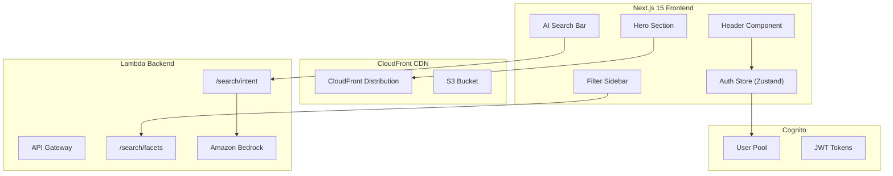
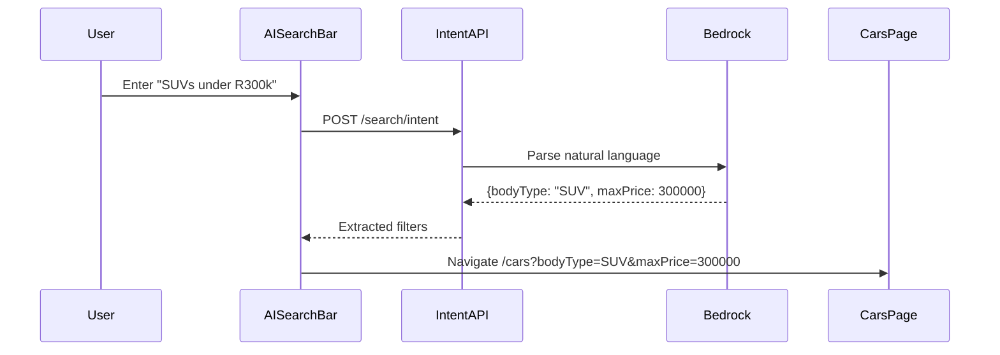

# Design Document: UAT Optimizations

## Overview

This design addresses seven key optimization areas identified during UAT for Prime Deal Auto:

1. **Logo Visibility Enhancement** - Increase header logo size from 120x40 to ~150x50 pixels
2. **Hero Section Copy Update** - Change headline from "Find Your Perfect Car" to "Prime Deal Auto"
3. **Static Image Migration** - Move hero and about page images from local `/public` to CloudFront/S3
4. **Cars Page Performance** - Optimize image loading with proper Next.js Image configuration
5. **Dynamic Filter Integration** - Connect Make/Model/Variant dropdowns to `/search/facets` API
6. **AI-Powered Search Bar** - Natural language search with Bedrock intent parsing
7. **Category Icon Routing** - Link body type icons to filtered car listings
8. **Global Auth State** - Zustand store for authentication state across all pages
9. **Staff Dashboard Access** - Role-based dashboard link in navigation

The optimizations span frontend UI changes, CDN architecture, API integration, and AI-powered search capabilities.

## Architecture

### High-Level Component Diagram



### Data Flow for AI Search



## Components and Interfaces

### 1. Header Component Updates

**File:** `frontend/components/layout/Header.tsx`

**Changes:**
- Increase logo dimensions from 120x40 to 150x50 pixels
- Maintain aspect ratio with `object-contain`
- Preserve white background container on solid header state
- Scale proportionally on mobile (< 640px)

**Interface (unchanged):**
```typescript
// No props - uses internal state for scroll detection
export function Header(): JSX.Element
```

### 2. Hero Section Updates

**File:** `frontend/components/home/HeroCarousel.tsx`

**Changes:**
- Update `HERO_IMAGES` array to use CloudFront URLs
- Add CloudFront domain to Next.js `remotePatterns`

**New Image URLs:**
```typescript
const CLOUDFRONT_DOMAIN = process.env.NEXT_PUBLIC_CLOUDFRONT_URL;

const HERO_IMAGES = [
  `${CLOUDFRONT_DOMAIN}/static/hero/hero1.jpg`,
  `${CLOUDFRONT_DOMAIN}/static/hero/hero2.jpg`,
  // ... hero3-6
];
```

**File:** `frontend/app/(public)/page.tsx` (or Hero section)

**Changes:**
- Update headline text from "Find Your Perfect Car" to "Prime Deal Auto"

### 3. Auth Store (Zustand)

**New File:** `frontend/lib/stores/auth-store.ts`

```typescript
interface AuthState {
  isAuthenticated: boolean;
  isLoading: boolean;
  user: AuthUser | null;
  role: 'user' | 'dealer' | 'admin' | null;
}

interface AuthUser {
  userId: string;
  email: string;
  groups: string[];
}

interface AuthActions {
  initialize: () => Promise<void>;
  signOut: () => Promise<void>;
  setUser: (user: AuthUser | null) => void;
}

type AuthStore = AuthState & AuthActions;
```

**Behavior:**
- `initialize()` - Called on app mount, checks Cognito session via `getCurrentUser()`
- Extracts `cognito:groups` from JWT to determine role
- Persists minimal state to localStorage for hydration
- `signOut()` - Clears state and calls Amplify `signOut()`

### 4. AI Search Bar Component

**New File:** `frontend/components/home/AISearchBar.tsx`

```typescript
interface AISearchBarProps {
  className?: string;
  placeholder?: string;
}

interface ParsedIntent {
  make?: string;
  model?: string;
  bodyType?: string;
  minPrice?: number;
  maxPrice?: number;
  minYear?: number;
  maxYear?: number;
  fuelType?: string;
  transmission?: string;
  fallbackQuery?: string; // If intent parsing fails
}
```

**Behavior:**
- Text input with search icon
- On submit, calls `/search/intent` API endpoint
- Shows loading spinner during processing
- Navigates to `/cars` with extracted query params
- Falls back to `?q=<query>` if parsing fails

### 5. Intent Parsing API Endpoint

**New Endpoint:** `POST /search/intent`

**Request:**
```typescript
interface IntentRequest {
  query: string;
}
```

**Response:**
```typescript
interface IntentResponse {
  success: boolean;
  filters: {
    make?: string;
    model?: string;
    bodyType?: string;
    minPrice?: number;
    maxPrice?: number;
    minYear?: number;
    maxYear?: number;
    fuelType?: string;
    transmission?: string;
  };
  confidence: number; // 0-1 score
  fallbackQuery?: string; // Original query if low confidence
}
```

**Bedrock System Prompt:**
```
You are a car search intent parser for Prime Deal Auto, a South African car dealership.
Extract structured filters from natural language queries.

Price format: South African Rand (ZAR). "R300k" = 300000, "R1.5M" = 1500000
Body types: SUV, Sedan, Hatchback, Bakkie, Coupe, Convertible, Wagon
Fuel types: petrol, diesel, electric, hybrid
Transmissions: automatic, manual, cvt

Return JSON with only the filters you can confidently extract.
If the query is unclear, return an empty filters object with confidence: 0.
```

### 6. Dynamic Filter Integration

**File:** `frontend/components/search/FilterSidebar.tsx`

**Current State:** Already fetches facets via `getSearchFacets()` and receives them as props.

**Enhancement:**
- Model dropdown: Fetch models filtered by selected make
- Variant dropdown: Fetch variants filtered by selected make + model
- Use TanStack Query for dependent queries with `enabled` flag

```typescript
// Dependent query for models
const { data: modelFacets } = useQuery({
  queryKey: ['facets', 'model', currentFilters.make],
  queryFn: () => getSearchFacets({ make: currentFilters.make }),
  enabled: !!currentFilters.make,
  select: (data) => data.model ?? [],
});

// Dependent query for variants
const { data: variantFacets } = useQuery({
  queryKey: ['facets', 'variant', currentFilters.make, currentFilters.model],
  queryFn: () => getSearchFacets({ 
    make: currentFilters.make, 
    model: currentFilters.model 
  }),
  enabled: !!currentFilters.make && !!currentFilters.model,
  select: (data) => data.variant ?? [],
});
```

### 7. Category Icon Routing

**File:** `frontend/components/home/HeroSearch.tsx`

**Current State:** Already implements body type links correctly:
```typescript
<Link href={`/cars?bodyType=${encodeURIComponent(query)}`}>
```

**Verification:** The `BODY_TYPES` array maps to correct query values:
- SUV → `/cars?bodyType=SUV`
- Bakkie → `/cars?bodyType=Bakkie`
- Sedan → `/cars?bodyType=Sedan`
- Hatchback → `/cars?bodyType=Hatchback`

### 8. Next.js Image Configuration

**File:** `frontend/next.config.ts`

```typescript
const nextConfig: NextConfig = {
  images: {
    remotePatterns: [
      {
        protocol: 'https',
        hostname: 'dyzz4logwgput.cloudfront.net',
        pathname: '/cars/**',
      },
      {
        protocol: 'https',
        hostname: 'dyzz4logwgput.cloudfront.net',
        pathname: '/static/**', // New: for hero/about images
      },
    ],
    deviceSizes: [640, 750, 828, 1080, 1200, 1920, 2048],
    imageSizes: [16, 32, 48, 64, 96, 128, 256, 384],
  },
};
```

## Data Models

### Auth Store State

```typescript
interface AuthState {
  isAuthenticated: boolean;
  isLoading: boolean;
  user: {
    userId: string;
    email: string;
    groups: string[]; // ['admin'] or ['dealer'] or []
  } | null;
  role: 'admin' | 'dealer' | 'user' | null;
}
```

### Intent Parsing Result

```typescript
interface ParsedFilters {
  make?: string;
  model?: string;
  bodyType?: string;
  minPrice?: number;
  maxPrice?: number;
  minYear?: number;
  maxYear?: number;
  fuelType?: 'petrol' | 'diesel' | 'electric' | 'hybrid';
  transmission?: 'automatic' | 'manual' | 'cvt';
}
```

### S3 Static Asset Structure

```
s3://prime-deal-auto-assets/
├── cars/
│   └── {carId}/
│       └── {imageId}.jpg
└── static/
    ├── hero/
    │   ├── hero1.jpg
    │   ├── hero2.jpg
    │   └── ... (hero3-6)
    └── about/
        ├── gallery1.jpg
        └── ... (about images)
```


## Correctness Properties

*A property is a characteristic or behavior that should hold true across all valid executions of a system—essentially, a formal statement about what the system should do. Properties serve as the bridge between human-readable specifications and machine-verifiable correctness guarantees.*

### Property Reflection

After analyzing the acceptance criteria, the following redundancies were identified and consolidated:

1. **Category icon routing (6.1-6.4)** - Four separate examples for SUV, Sedan, Hatchback, Bakkie can be consolidated into one property about body type routing
2. **AI filter mapping (7.3-7.8)** - Six separate filter type mappings can be consolidated into one comprehensive intent parsing property
3. **Auth state display (9.1-9.3, 9.6)** - Multiple auth state conditions can be consolidated into one property about auth-dependent UI
4. **Staff dashboard access (10.1-10.2, 10.4)** - Role-based link display can be consolidated into one property

### Property 1: CloudFront Image URLs

*For any* image rendered in the HeroCarousel or About page components, the image `src` attribute SHALL begin with the CloudFront distribution domain.

**Validates: Requirements 3.3, 3.4**

### Property 2: Dependent Filter Queries

*For any* make selection in the FilterSidebar, the model dropdown query SHALL include the selected make as a filter parameter, AND *for any* make+model selection, the variant dropdown query SHALL include both make and model as filter parameters.

**Validates: Requirements 5.2, 5.3**

### Property 3: Facet Count Display

*For any* facet item displayed in the FilterSidebar, the item SHALL display both the value text and the count of matching cars in the format "{value} ({count})".

**Validates: Requirements 5.4**

### Property 4: Cascading Dropdown Disabled State

*For any* filter state where make is not selected, the Model dropdown SHALL be disabled, AND *for any* filter state where make OR model is not selected, the Variant dropdown SHALL be disabled.

**Validates: Requirements 5.7, 5.8**

### Property 5: Body Type URL Filter Application

*For any* bodyType query parameter in the URL, the Cars page SHALL apply that value as a filter and display only cars matching that body type.

**Validates: Requirements 6.5**

### Property 6: Category Icon Navigation

*For any* body type category icon (SUV, Sedan, Hatchback, Bakkie), clicking the icon SHALL navigate to `/cars?bodyType={bodyType}` where {bodyType} matches the icon's label.

**Validates: Requirements 6.1, 6.2, 6.3, 6.4**

### Property 7: Intent Parsing Filter Extraction

*For any* natural language query containing recognizable filter terms (price ranges, body types, makes, models, years, fuel types, transmissions), the intent parser SHALL extract the corresponding structured filter parameters.

**Validates: Requirements 7.2, 7.3, 7.4, 7.5, 7.6, 7.7, 7.8**

### Property 8: Search Navigation with Extracted Filters

*For any* successfully parsed intent, the AI Search Bar SHALL navigate to `/cars` with the extracted filter parameters as query string parameters.

**Validates: Requirements 7.9**

### Property 9: Filter Search Button Application

*For any* set of selected filters in the FilterSidebar, clicking the Search button SHALL navigate to `/cars` with all selected filter values as query parameters.

**Validates: Requirements 8.2**

### Property 10: Auth-Dependent Header Display

*For any* authentication state, the Header component SHALL display:
- If authenticated: profile/dashboard link, NO "Sign In" link, NO "Register" link
- If not authenticated: "Sign In" link, "Register" link, NO profile/dashboard link

**Validates: Requirements 9.1, 9.2, 9.3**

### Property 11: Sign Out State Update

*For any* sign out action, the Header component SHALL immediately update to display the signed-out state (Sign In and Register links visible).

**Validates: Requirements 9.6**

### Property 12: Role-Based Dashboard Link

*For any* authenticated user, the Header component SHALL display:
- If user has 'admin' or 'dealer' group: "Dashboard" link pointing to `/dashboard`
- If user has no staff groups: "My Account" or profile link

**Validates: Requirements 10.1, 10.2, 10.4**


## Error Handling

### AI Search Bar Errors

| Error Scenario | Handling |
|----------------|----------|
| Bedrock API timeout | Show toast "Search is taking longer than expected", fall back to `?q=<query>` |
| Bedrock API error | Log error, fall back to full-text search with `?q=<query>` |
| Low confidence parse (< 0.3) | Fall back to full-text search with `?q=<query>` |
| Empty query submission | Prevent submission, show validation message |
| Network error | Show toast "Unable to connect", allow retry |

### Auth Store Errors

| Error Scenario | Handling |
|----------------|----------|
| Cognito session expired | Set `isAuthenticated: false`, clear user state |
| `getCurrentUser()` throws | Set loading false, assume signed out state |
| Token refresh failure | Trigger sign out, redirect to login |
| Network error during auth check | Use cached state if available, retry on next navigation |

### Filter API Errors

| Error Scenario | Handling |
|----------------|----------|
| `/search/facets` fails | Show cached facets if available, display error toast |
| Dependent query fails | Keep dropdown disabled, show error state |
| Empty facet response | Show "No options available" in dropdown |

### Image Loading Errors

| Error Scenario | Handling |
|----------------|----------|
| CloudFront image 404 | Next.js Image shows placeholder, log error |
| CloudFront timeout | Retry with exponential backoff (handled by browser) |
| Invalid image format | Show fallback placeholder image |


## Testing Strategy

### Dual Testing Approach

This feature requires both unit tests and property-based tests:

- **Unit tests**: Verify specific examples, edge cases, UI rendering, and integration points
- **Property tests**: Verify universal properties across all inputs using randomized testing

### Property-Based Testing Configuration

- **Library**: fast-check (JavaScript/TypeScript PBT library)
- **Minimum iterations**: 100 per property test
- **Tag format**: `Feature: uat-optimizations, Property {number}: {property_text}`

### Unit Test Coverage

| Component | Test Focus |
|-----------|------------|
| Header | Logo dimensions (150x50), auth state rendering, role-based links |
| HeroCarousel | CloudFront URL format, image rotation |
| AISearchBar | Loading state, navigation on submit, fallback behavior |
| FilterSidebar | Dropdown disabled states, facet count display, search button |
| AuthStore | Initialize flow, sign out, role extraction from JWT |

### Property Test Coverage

| Property | Generator Strategy |
|----------|-------------------|
| P1: CloudFront URLs | Generate image component renders, verify URL prefix |
| P2: Dependent Queries | Generate make/model selections, verify query params |
| P3: Facet Counts | Generate facet data, verify display format |
| P4: Dropdown States | Generate filter state combinations, verify disabled states |
| P5: Body Type Filter | Generate bodyType values, verify filter application |
| P6: Category Navigation | Generate body type clicks, verify navigation URL |
| P7: Intent Parsing | Generate NL queries with known patterns, verify extraction |
| P8: Search Navigation | Generate parsed intents, verify query string |
| P9: Filter Search | Generate filter selections, verify navigation params |
| P10: Auth Display | Generate auth states, verify UI elements |
| P11: Sign Out | Generate sign out actions, verify state update |
| P12: Role Links | Generate user roles, verify link display |

### Edge Cases (Unit Tests)

- Empty query submission in AI Search Bar
- No facets returned from API
- User with multiple Cognito groups (admin + dealer)
- CloudFront image 404 handling
- Auth check during SSR (should not throw)

### Integration Tests

- AI Search Bar → Intent API → Cars page navigation
- Auth Store → Header → Dashboard link visibility
- FilterSidebar → Facets API → Dependent dropdowns

### E2E Tests (Playwright)

- Full search flow: Enter NL query → Parse → Navigate → View results
- Auth flow: Sign in → See dashboard link → Sign out → See sign in link
- Filter flow: Select make → Select model → Click search → View filtered results

